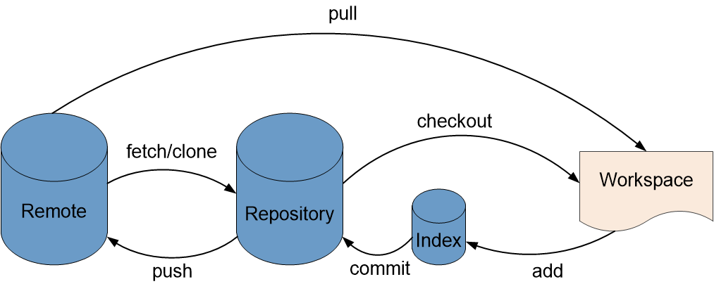
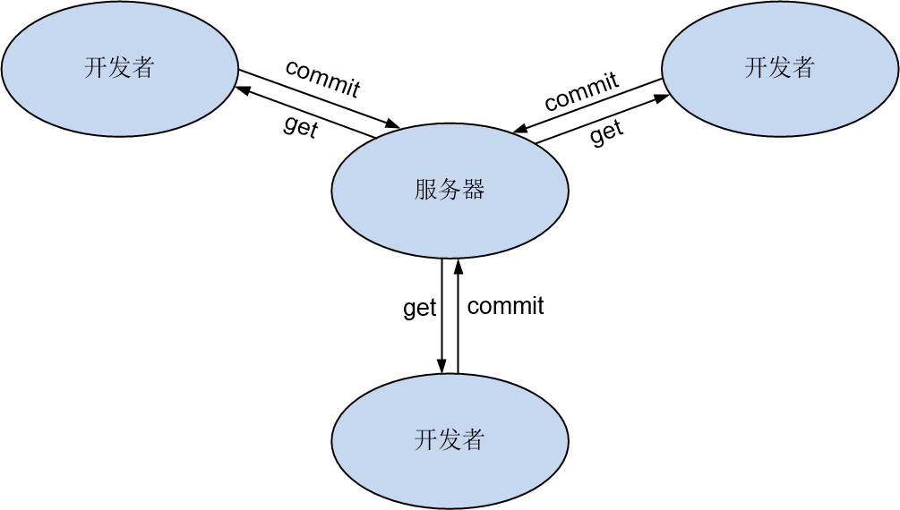

# 代码管理概述

## 代码管理功能及特点

* 适配Git和SVN，覆盖常用的版本及代码管理工具。
* Git代码库一键导入，高效完成代码迁移。
* 分支管理，实现多分支并行开发，达到开发隔离，发布统一的目的，管理效率高。
* 在线代码预览，随时随地阅读代码，不受地域限制。
* 分支保护，可防止分支被其他人提交或误删。
* 成员及权限管理，保护核心资产安全。
* Git标签管理，帮助团队进行版本管理，以便日后精确检索历史版本。
* 代码提交记录查询，可视化代码修改过程，问题可追溯。

## 基于Git的工作模式
Git是一个分布式版本控制系统。Git在远端和本地都有一个完整的代码仓库。开发者在本地的代码仓库中修改文件、编写代码，然后将本地仓库的修改推送到远端仓库中。基于Git的工作模式如下图所示。

其中：
* remote：远端仓库
* repository：本地仓库
* index：本地仓库暂存区
* workspace：本地仓库工作区
在本地开发前：需要通过pull命令从远端仓库中，将代码拉取到本地工作区。然后再开始开发代码。
在本地开发代码完成后，需要：
1. 通过add命令将本地修改内容添加到本地仓库暂存区。
2. 通过commit命令将暂存区的内容签入到本地仓库中。
3. 通过push命令将本地仓库中的内容推送到远端仓库。
然后，本地开发的代码就已经托管到远端仓库中了。
Git一般采用分支开发，合并主干的开发方式，详细请参见[Git分支概述](9.7.1.1 git分支概述.html)。

## 基于SVN的工作模式

SVN是一个集中式版本控制系统，存在一个中央版本库。所有开发者从中央版本库中获取代码到本地。本地开发完成后，提交文件到中央版本库，将各开发者的内容合并到统一的版本中。基于SVN的工作模式如下图所示。

