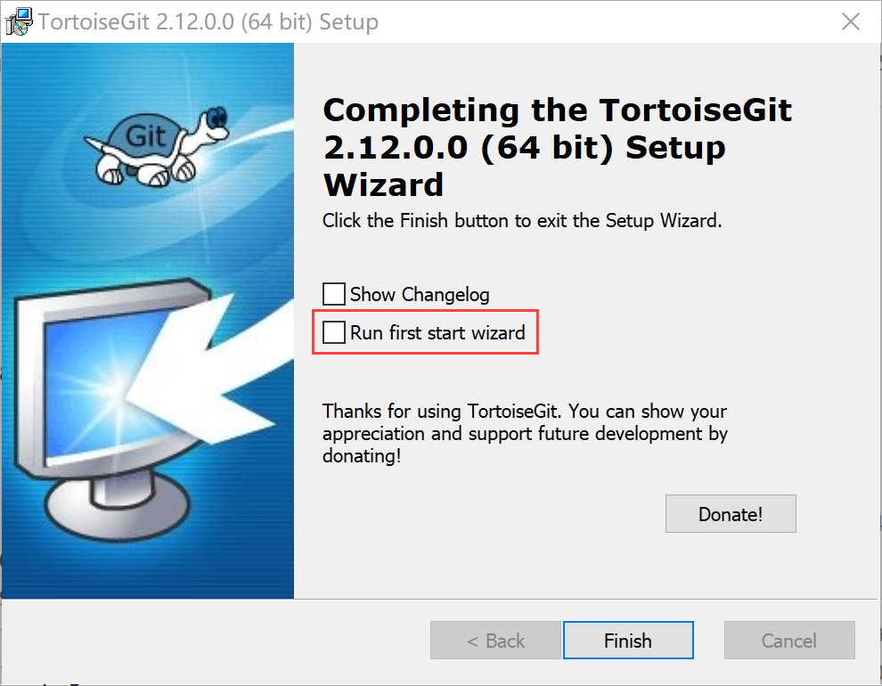
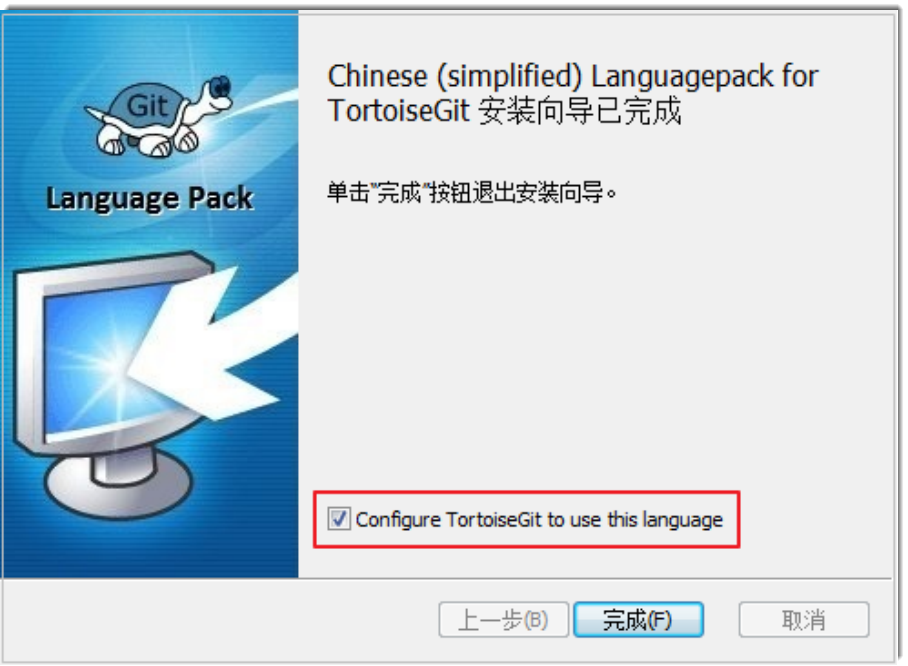

# 安装和配置Windows TortoiseGit客户端

如果您不熟悉Git命令，或者从以前的SVN迁移到系统的Git代码库，推荐使用TortoiseGit的可视化操作界面。
1. 打开[TortoiseGit官网下载链接](https://tortoisegit.org/download/)，根据您的操作系统位数下载32位/64位的安装包。
2. 双击运行安装包，根据安装向导提示信息，在“Finish”步骤中，去勾选“Run first start wizard”，单击“Finish”，完成安装。                   
     
    
3. 在弹出的第一次启动引导中，会有Language语言选择、Git可执行路径配置（自动填充可用的Git路径）、配置用户名和邮箱。保持默认设置，依次单击“Next”完成即可。
4. （可选）安装语言包。           
     TortoiseGit的安装包默认为英文，可以从[TortoiseGit官方下载链接](https://tortoisegit.org/download/)下载语言包（Language Packs）。
     
     需要使用中文界面，则选择Chinese simplified语言包，下载对应的32位/64位的语言包然后双击运行，在完成之前勾选“Configure TortoiseGit to use this language”即可完成汉化。            
     

