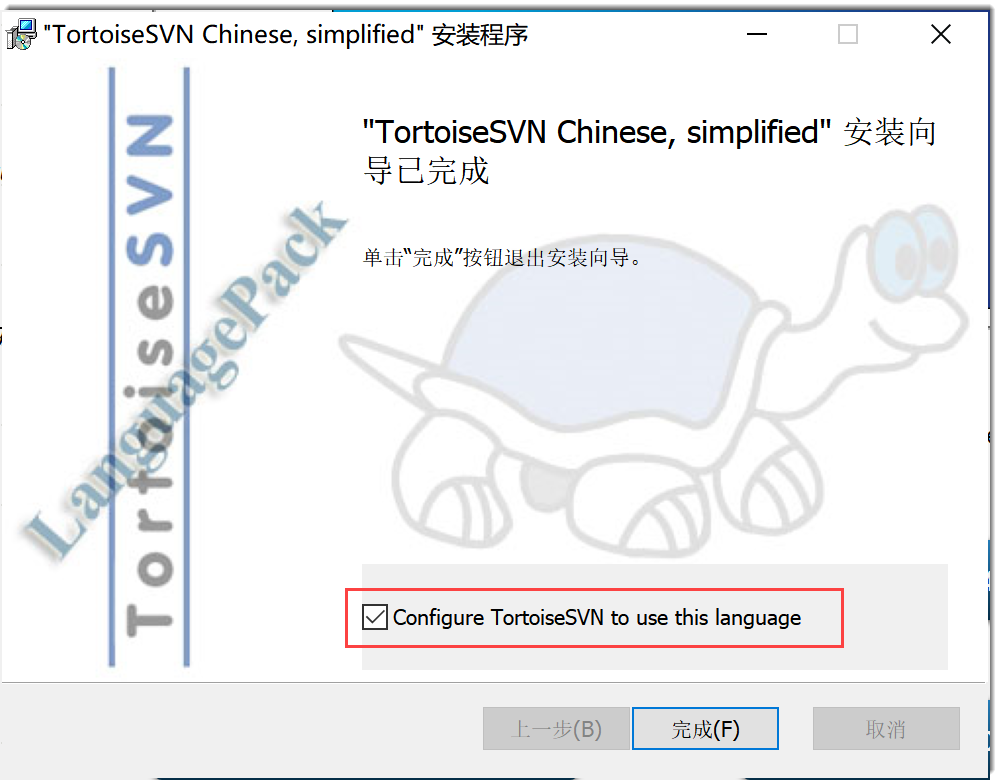

# 安装和配置SVN客户端

当您在系统上基于SVN创建代码库时，您需要在本地安装和配置TortoiseSVN客户端，用于连接系统代码库，并执行代码库相关操作。

1. 访问[TortoiseSVN官网](https://tortoisesvn.net/downloads.html)，根据操作系统下载合适的TortoiseSVN安装包。
2. 双击TortoiseSVN安装包，根据安装向导提示信息，完成安装。
3. （可选）安装语言包。
  1. 在[TortoiseSVN官网](https://tortoisesvn.net/downloads.html)下方，下载需要的软件包。
  2. 双击语言包，根据安装向导提示信息，在最后一步，勾选“Configure TortoiseSVN to use this language”，完成安装。            
        