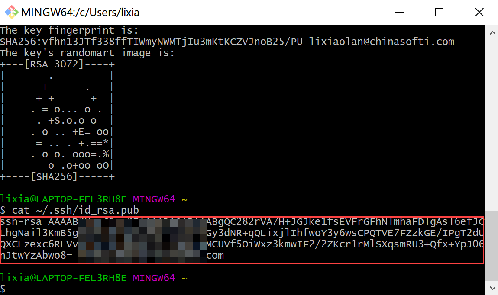
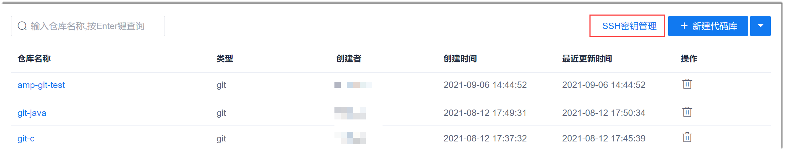

# 配置rsa密钥

ras密钥适用于通过Git Bash、Linux Git、mac Git客户端对代码库进行克隆、拉取、推送等操作，不适用于TortoiseGit客户端。如果您只需使用Git Bash、Linux Git、mac Git客户端，通过SSH协议对git代码库进行操作，则配置rsa密钥即可。

### 前提条件
* 已安装相应的Git 客户端。

### 操作步骤
1. 打开命令行类Git客户端。
2. （可选）查看计算机中是否已生成SSH密钥。       
```
# cd ~/.ssh
```

如果能进入该目录，表示已生成SSH密钥，请执行第4步：查看密钥；如果提示该目录不存在，表示未生成SSH密钥，请执行第3步：生成SSH密钥。
3. （可选）生成SSH密钥。       
   生成SSH密钥。     
```
# ssh-keygen -t rsa -C "您的Email地址"
```
    
    执行命令后，会：                        
    1）提示设置密钥的存放路径。直接按Enter键，表示使用默认路径。建议采用默认路径。             
    2）提示输入一个密码，这个密码会在你提交项目时使用。如果为空的话提交项目时则不用输入。建议采用不输入密码方式，直接按Enter键。                         
    3）提示再次输入密码。       
    <p>如果使用默认路径，则生成的SSH密钥存放在在“~/.ssh/id_rsa”和“~/.ssh/id_rsa.pub”中。</p>   
4. 查看密钥。       
```
# cat ~/.ssh/id_rsa.pub
```
  
5. 拷贝密钥内容。                        
      
6. 打开系统，进入项目的“代码库”。在代码库列表页面中，单击“SSH密钥管理”。      
      
7. 在密钥列表页面中，单击“添加SSH密钥”。         
        
8. 在“添加SSH密钥”页面中，输入密钥标题，粘贴拷贝的密钥内容，单击“确认”。        
     

添加完成后，页面返回SSH密钥列表页面。您可以看到添加的SSH密钥。
