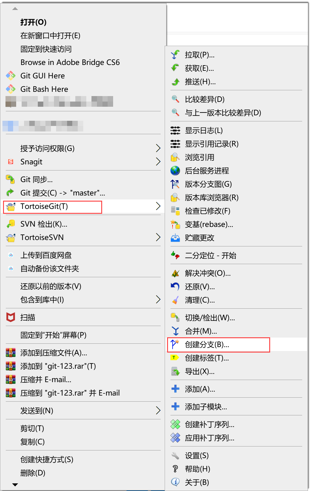

# 创建分支

请根据项目的分支规范，创建需要的分支。     

### 前提条件
* 已创建代码仓库。
* 已使用具有代码库“分支管理”权限，且已成为代码库成员的账号登录系统。

### 在系统远端创建
1. 在代码库列表中，单击代码库名称，进入代码库详情界面。
2. 单击“分支”页签，进入分支列表界面。        
     
   
3. 在右上方，单击“新建分支”。
4. 在弹出的“新建分支”对话框中，设置新分支的基础分支，以及新分支的名称，单击“创建”。             
     
     
     其中，“新建分支名”支持最多64个字母、数字、中文、“-”、“_”字符，且只能以字母、数字开头。              
    创建成功后，返回到分支列表界面，显示新建的分支。分支列表以分支名称正序排列。

### 通过Git Bash/Linux git/mac git客户端创建
1. 进入本地仓库目录，查看当前的分支。
```
    $ git branch -a
```
2. 创建分支。
```
    # 命令
    $ git branch <分支名称>
    # 举例：创建“test”分支
    $ git branch test
```
3. 将当前分支切换到“test”分支。
```
    $ git checkout test
```

### 通过TortoiseGit客户端创建
1. 右键单击本地仓库名称，选择“TortoiseGit > 创建分支”。         
  
  
2. 在对话框中输入分支名称、分支基线，单击“确定”。              
     如果需要将当前分支切换到新建的分支，在上面的对话框中勾选“切换到新分支”。                      
     