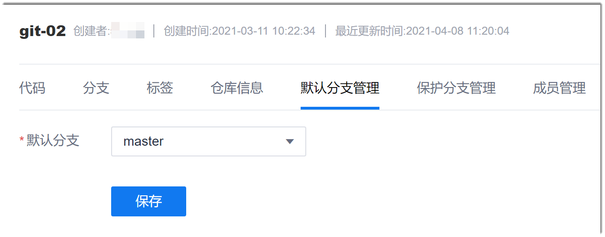

# 设置默认分支

代码库创建成功后，默认将master分支作为默认分支，您可以根据实际情况设置。设置默认分支后：
* 进入仓库时，默认选中默认分支
* 创建合并请求时，默认的目标分支为默认分支。

### 前提条件
* 代码库中具有至少2个分支。
* 已使用具有代码库“默认分支管理”权限，且已成为代码库成员的账号登录系统。

### 在系统中设置
1. 在代码库列表中，单击代码库名称。
2. 在代码库详情页面中，单击“默认分支管理”页签。                  
  
  
3. 在默认分支管理界面中，选择默认分支，单击“保存”。

### 通过Git Bash/Linux git/mac git客户端设置              
通过Git Bash/Linux git/mac git客户端设置默认分支，即设置push和pull的默认分支。当执行**git push**和**git pull**命令时，可以省略后面的参数，直接执行**git push**和**git pull**命令。
```
    $ git branch --set-upstream-to=<远端分支名> <本地分支名>
```
> [!NOTE]
> 远端分支和本地分支必须是已经存在的分支。

例如：将默认分支设置为“master分支”。
```
    $ git branch --set-upstream-to=origin/master master
```

### 通过TortoiseGit客户端设置

使用TortoiseGit客户端时无需设置默认分支。需要操作某个分支时，直接切换到对应分支即可。
