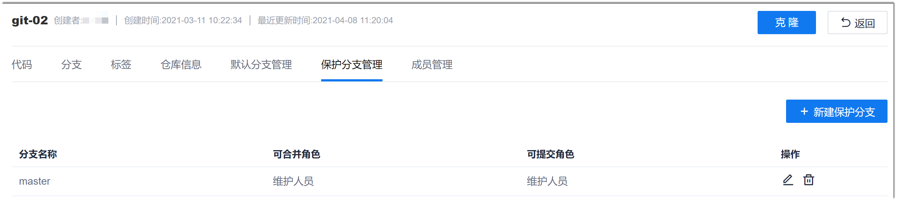
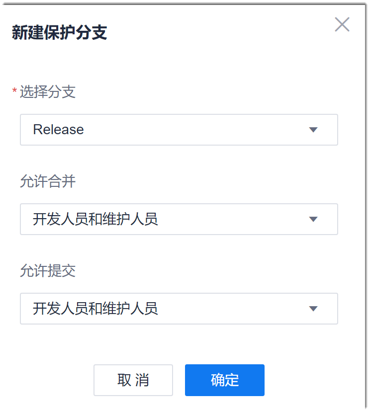

# 设置分支保护

为了确保分支的安全性，即防止分支中的代码被无关的人修改、删除，同时允许开发者在分支中合入代码，您可以将分支设置为保护分支。

分支保护为系统远端仓库的功能，只能在系统中操作。

### 前提条件
* 已创建代码库。
* 已使用具有代码库“受保护分支管理”权限，且已成为代码库成员的账号登录系统。

### 操作步骤
1. 在项目的代码库列表中，单击代码库名称，进入代码库详情界面。
2. 单击“保护分支管理”页签。             
                
3. 在右上角单击“新建保护分支”。
4. 在“新建保护分支”对话框中，选择需要保护的分支，并设置对应的权限。如果不设置，表示此分支不允许合并和提交。然后单击“确定”。                      
   