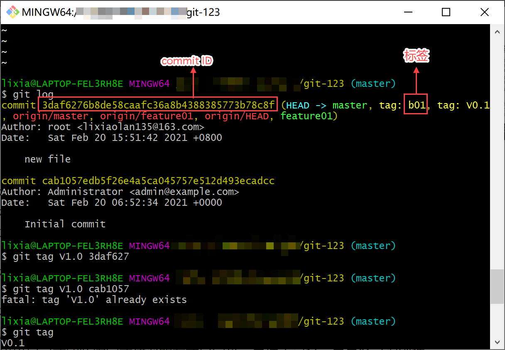
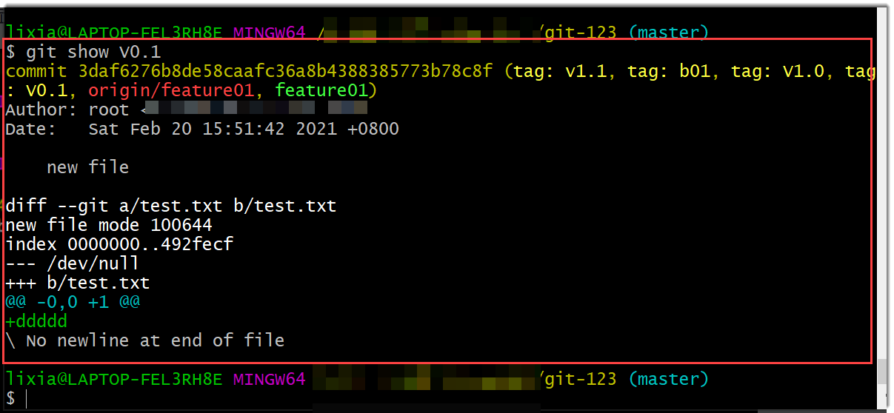
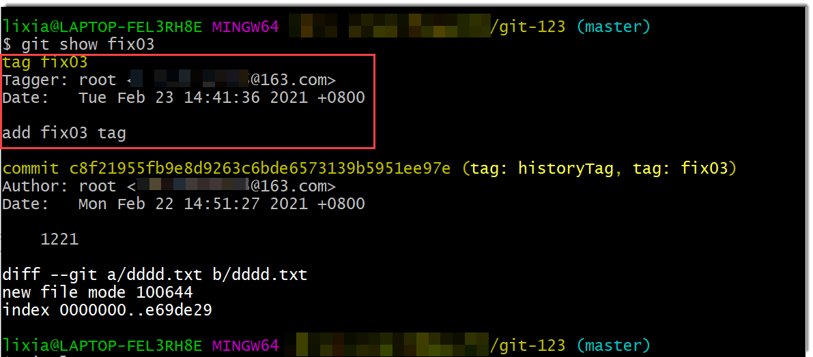

# 管理标签

标签（tag）是Git提供的帮助团队进行版本管理的工具，您可以使用Git标签标记提交，从而将项目中的重要的版本管理起来，以便日后精确检索历史版本。

标签指向一个提交（commit），相当于指向一个被保存的版本快照。

在使用Git进行代码管理时，我们可以根据每次提交的ID去查找、追溯历史版本。这个ID是一长串随机编码（如下图中所示），不便于记忆。而标签可以以自己或团队约定或建议的方式自定义，更便于记忆，更具备可识别性。您可以给重要的版本打上标签，例如“ myTag_V1.0.0 ”、“首个商业化版本”），便于记忆和追溯。

 

Git标签有两类：
* 轻量标签（lightweight）：是一个特定提交的引用，相当于给特定提交取个别名。查看轻量标签时，显示的信息如下图所示。

  

* 附注标签（annotated）：是一个特定提交的引用，同时，在Git中被作为一个完整对象存储。相比于轻量标签，附注标签可以为标签附上说明，类似代码的注释功能，方便注解标签。在标签信息的记录中，除包括标签名、附注标签说明外，同时包含了打标签者名字、电子邮件地址、打标签时间/日期。查看附注标签时，显示的信息如下图所示。附注标签比轻量标签显示的更多信息如下图的红框中所示。

  

### 前提条件
* 已使用具有代码库“标签管理”权限，且已成为代码库成员的账号登录系统。
* 已创建代码库。