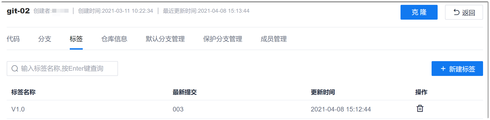
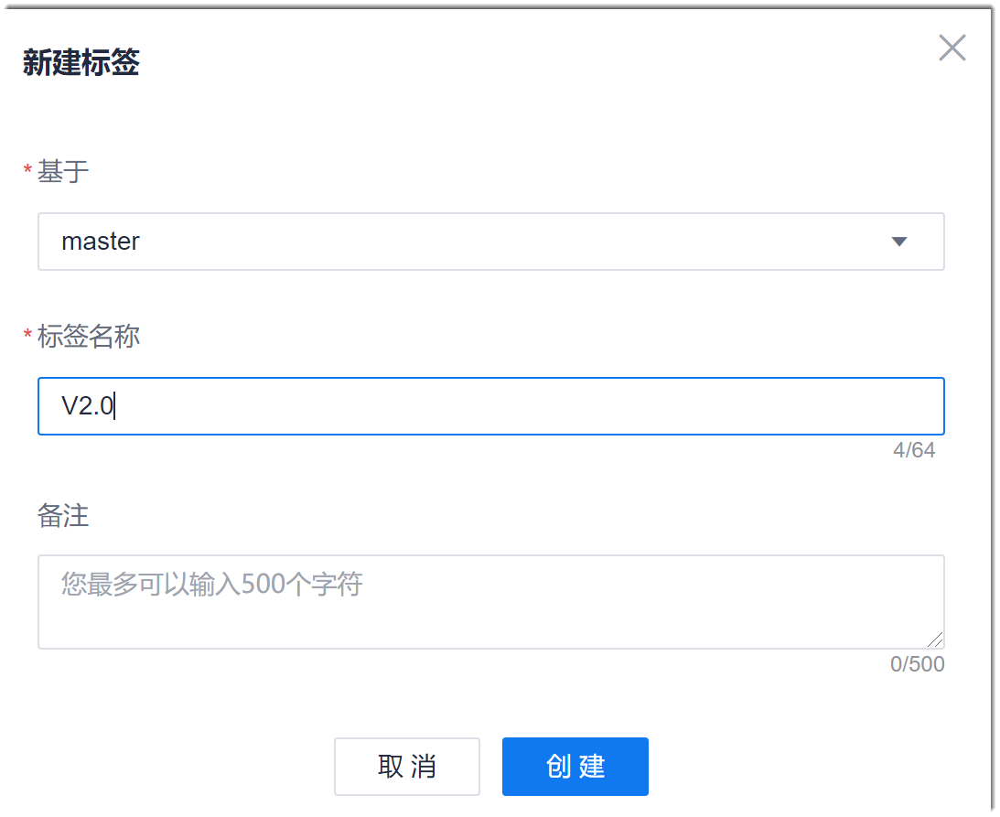

# 在远端仓库中管理标签

在远端仓库中，只能新增和删除标签。如果需要为某个提交打标签，或者将某个标签的版本检出，请通过客户端操作。

### 创建标签
1. 在Git仓库详情页面中，单击“标签”页签。
   
   
   
2. 在右上角单击“新建标签”。
3. 在“新建标签”对话框中，设置标签作用的分支，输入标签名称和备注，单击“创建”。
  

|参数名称|填写说明|
|:--------- |:-------- |
|基于|标签作用的分支。|
|标签名称|标签的名称。最多支持64个字符，允许的字符为：字母、数字、中文、"-" 、"_" 、"."，且以数字字母开头。
|备注|如果在备注中输入信息会生成附注标签（“备注”的内容相当于**git tag**命令中“-m”后面的内容），不输入则生成轻量标签。|

返回标签列表界面，显示刚刚创建成功的标签。

### 删除标签
在标签列表中，您可以单击标签后面的，删除标签。
