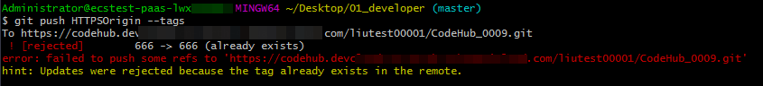
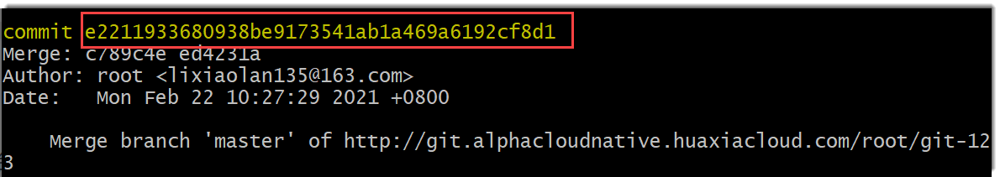

# 通过Git Bash/Linux Git/mac Git客户端管理标签

通过Git Bash/Linux Git/mac Git客户端可以创建、删除标签，为最新提交的版本和历史提交打标签，以及使用标签找回历史版本。

### 创建标签

通过Git Bash/Linux Git/mac Git客户端创建标签时，会自动给最近的提交打上标签。
1. 新建标签。
  * 新建轻量标签
```
    # 命令
    $ git tag <标签名称>
    # 举例
    $ git tag V1.0
```
  * 新建附注标签
```
     # 命令
     $ git tag -a <标签名称> -m "<标签说明>"
     # 举例
     $ git tag -a V1.0 -m "第一个版本"
```
2. 将标签推送到远端仓库。
```
    # 命令：推送某个标签
    $ git push <远程仓库地址或别名> <推送的标签名称>
    # 举例：推送某个标签
    $ git push origin V1.0
    # 命令：推送全部标签
    $ git push <远程仓库地址或别名> --tags
    # 举例：推送某个标签
    $ git push origin --tags
```
> [!NOTE]
> 如果您在远程仓库建立了一个标签，又在本地仓库建立了一个同名的标签，则推送时会失败（出现标签冲突，如下图所示），只能删除其一，再次推送。
> 


标签的其它相关操作命令如下：
```
    # 查看仓库内的所有标签
    $ git tag
    # 查看指定标签的信息
    $ git show <查看的标签名称>
    # 删除本地标签
    $ git tag -d <删除的标签名称>
    # 删除远端仓库的标签
    $ git push <远程仓库地址或别名> :ref/tags/<删除的标签名称>
```

### 为历史提交打标签
1. 查看历史提交，获取历史提交ID。
```
    $ git log
```

  历史提交ID如下图所示。
  
  

2.  给某个历史提交打标签。
```
    # 命令
    $ git tag -a historyTag -m "<备注信息>" <历史提交ID>
    # 举例
    $ git tag -a historyTag -m "make history rag" e22119
```

  其中，命令中的“历史提交ID”可以只截取前面几位数，无需完整的ID。


### 使用标签找回历史版本
当您需要查看某个标签指向的版本代码时，可以将其检出到工作区。被检出的版本是某个版本的快照，不能add、commit。因此，如果您需要修改此版本的代码，您可以基于工作区新建一条分支，再在此分支上修改代码，并将此分支合入主干。具体的操作步骤如下。您可以根据实际情况选择执行相应的步骤。

1.  通过标签检出历史版本到工作区。
```
    # 命令
    $ git checkout <标签名称>
    # 举例
    $ git checkout V2.0.0
```
2. 基于当前的工作区新建一条分支，并切换到新分支。
```
    # 命令
    $ git switch -b <新分支名称>
    # 举例
    $ git switch -b forFixV2.0.0
```
3. （可选）如果修改了新建的分支的内容，需要将修改内容提交到该分支的版本库中，并推送到远端仓库。
```
    # 将修改添加到新分支的暂存区
    $ git add .                           
    # 将修改内容存入该分支的本地仓库
    $ git commit -m "fix bug for V2.0.0"
    # 将修改内容推送到远端仓库
    $ git push origin forFixV2.0.0
```
4. 将新建立的分支内容合入主干分支master。
  
  详细操作请参见[通过Git Bas/Llinux Git/mac Git客户端开发并提交代码](9.6.1.1-via-git-bash-linuxgit-macgit.md#操作步骤)中的步骤6 “合并分支”。
