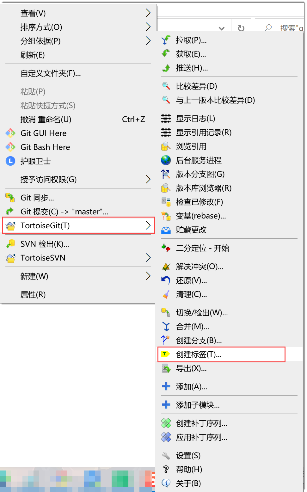
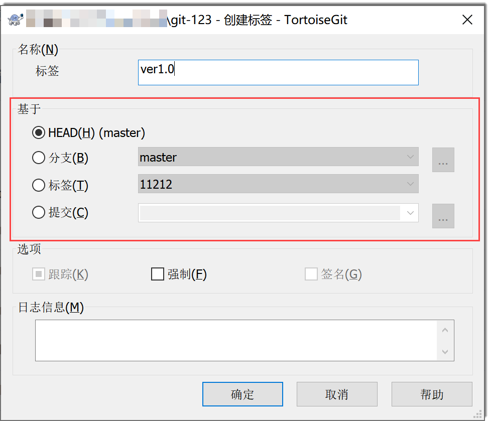
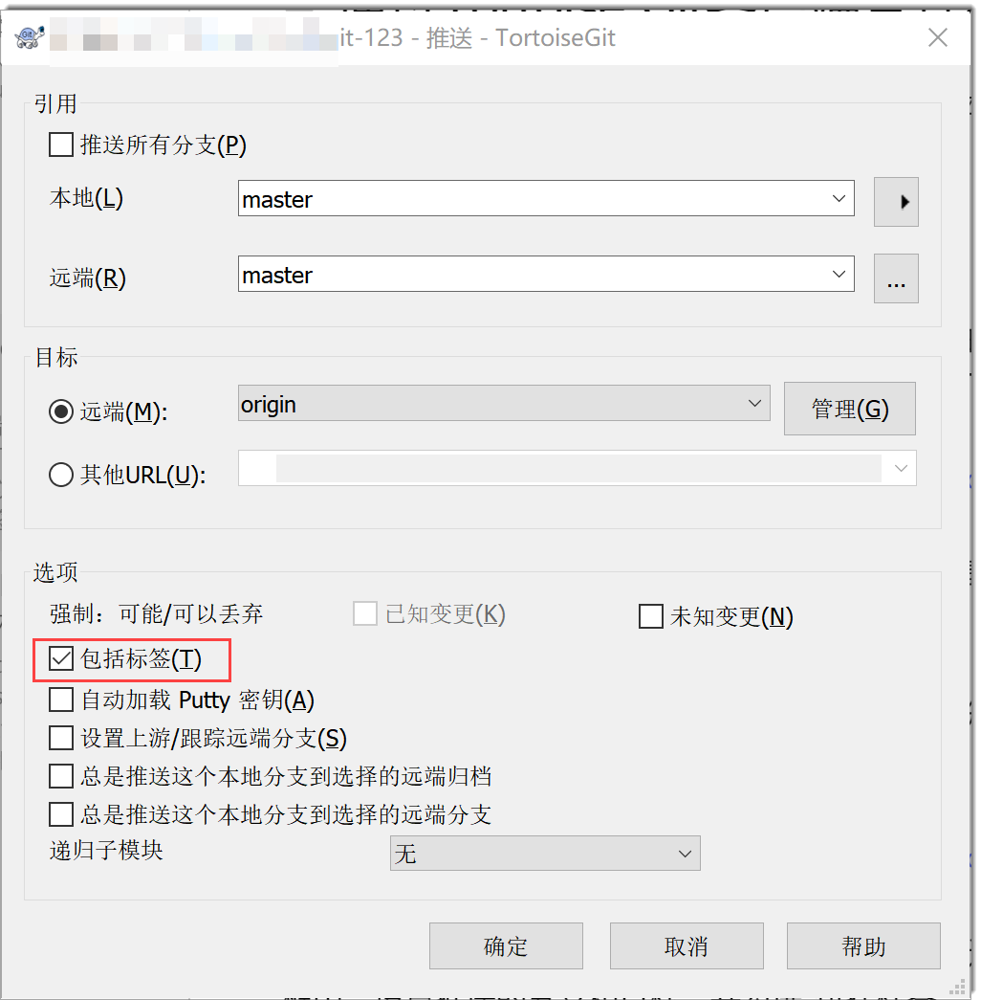
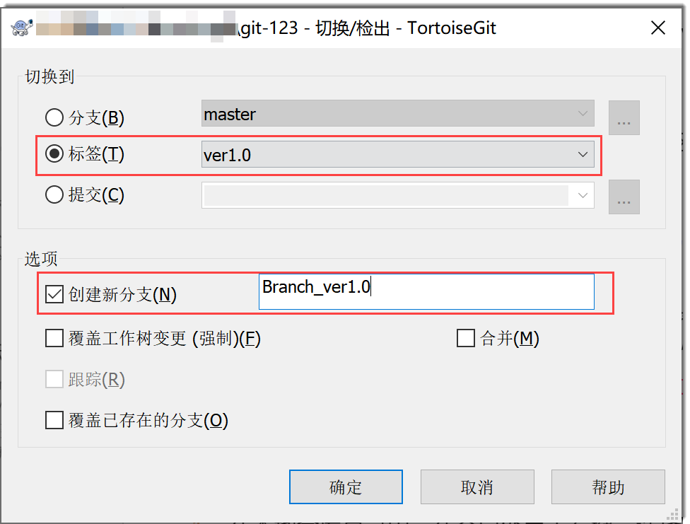
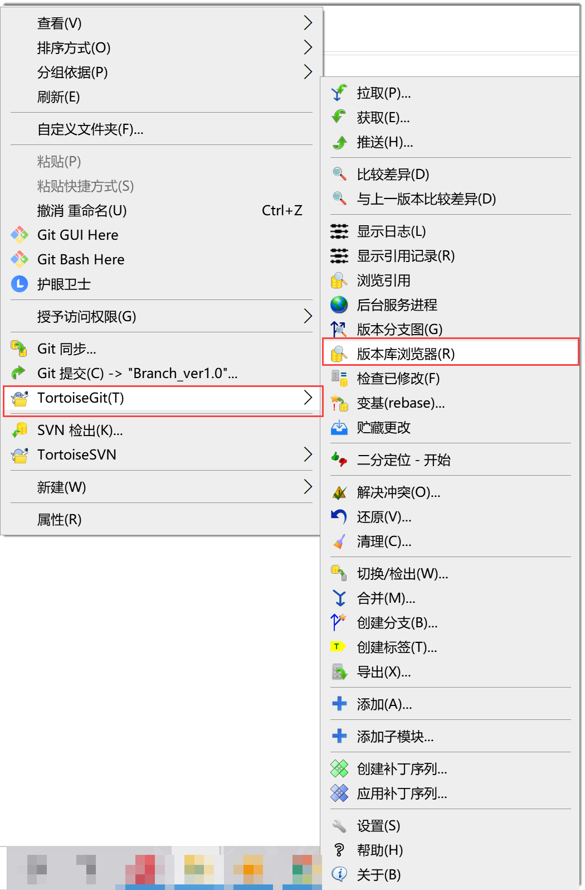
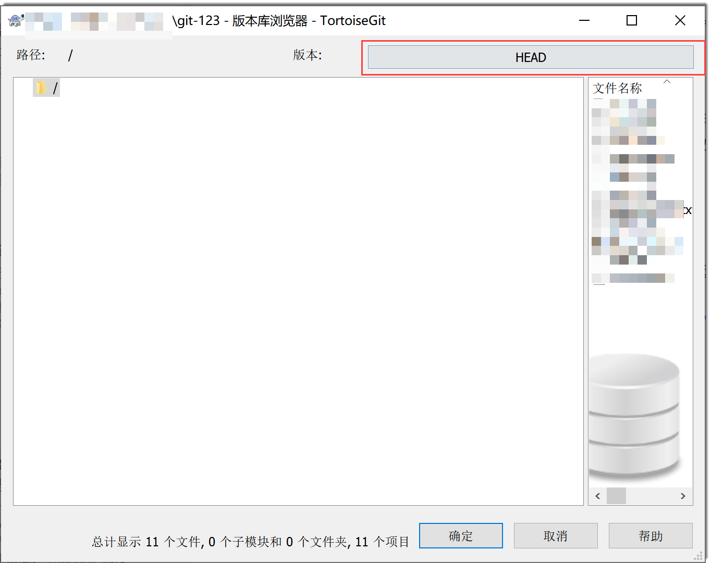
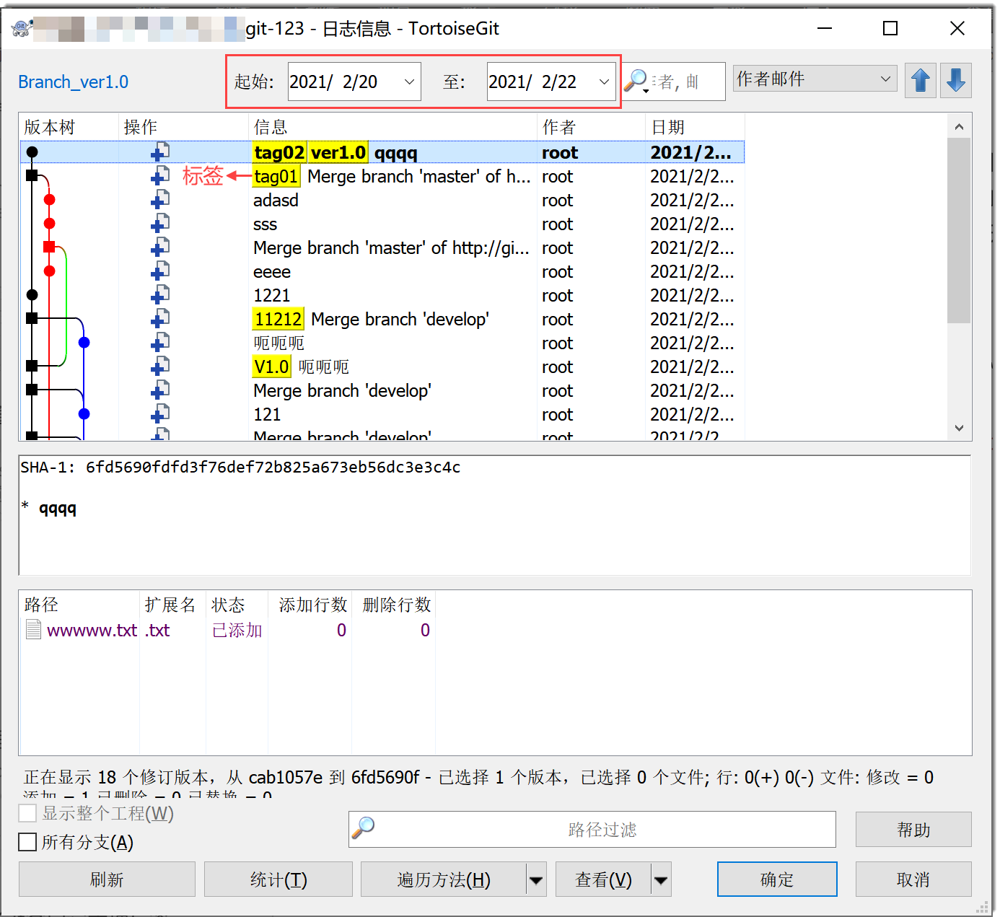

# 通过Tortoise Git客户端管理标签

通过Tortoise Git客户端可以创建、删除标签，为版本打标签，以及使用标签找回历史版本。

### 创建标签并为版本打标签                  
通过Tortoise Git客户端创建标签时，会自动给基于的版本打上标签。
1. 进入本地仓库目录，在空白处单击右键，选择“TortoiseGit > 创建标签”。               
  

2. 在创建标签对话框中，输入标签名称，并设置“基于”版本，即设置为哪个版本打上该标签，然后单击“确定”。
  * HEAD：基于当前分支。
  * 分支：可以选择基于某个分支的最新版本（区分本地和远端）。
  * 标签：基于某个标签。
  * 提交：基于历史某次提交。

  
  
3. 将标签提交到远端仓库。                       
      在文件夹中，单击右键，选择“TortoiseGit > 推送”。然后，在推送对话框中，设置推送的分支和目标，并勾选“包括标签”，单击“确定”。                        
      

### 使用标签找回历史版本                    
当您需要查看某个标签指向的版本代码时，可以将其检出到工作区。被检出的版本是某个版本的快照，是只读版本。因此，如果您需要修改此版本的代码，您可以基于该版本新建一条分支，再在此分支上修改代码，并将此分支合入主干。
1. 在本地仓库目录中，在空白处单击右键，选择“TortoiseGit > 切换/检出”。
2. 在切换/检出对话框中，设置切换到的标签。如有需要，勾选“创建新分支”，并设置分支名称，单击“确定”。                       
                            
    如果新建了分支，则当前分支会切换到新分支。                         
3. 在此分支上修改代码，并合并入主干。

### 删除标签             
当标签不再使用时，可以删除标签。
1. 在本地仓库目录中，在空白处单击右键，选择“TortoiseGit > 切换/检出”。                             
                      
2. 在版本库浏览器对话框中，单击“版本”后的版本框。                     
                             
  打开日志信息页面，显示指定日期下的版本情况。其中，黄色底色的内容为标签。                     
                       
3. 右键单击有标签的版本，选择“删除(D) refs/tags/<标签名称>”。然后在弹出的确认框中，单击“删除”。                     
  本地仓库已删除该tag，该tag在版本列表中消失。                 
4. （可选）登录远端仓库，在标签列表中删除该tag。

