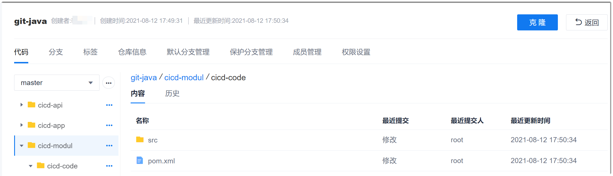
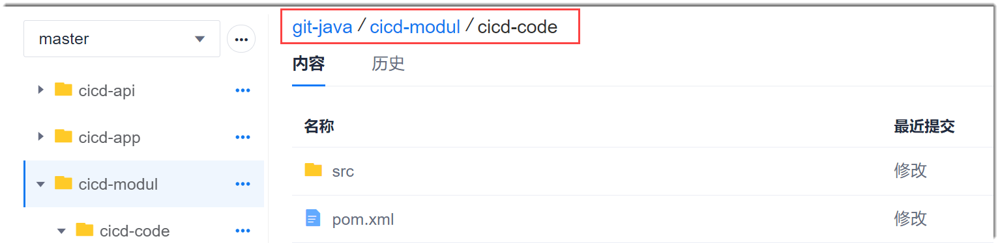
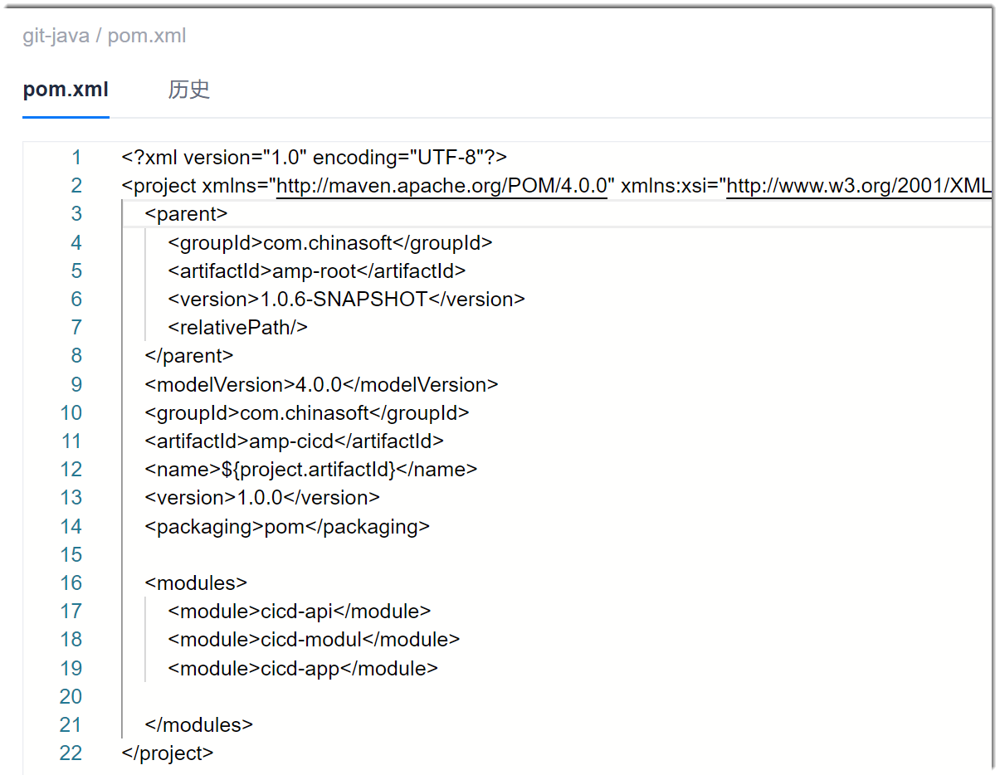

# 在线查看代码

在系统的代码库中，支持代码文件的在线预览。

### 前提条件
* 已创建代码仓库，且代码仓库中有支持预览的代码文件。
* 已使用具有代码库“在线浏览代码”权限，且已成为代码库成员的账号登录系统。

### 背景信息
当前支持预览的代码文件类型包括：
.js、.ts、.vue、.css、.scss、.sass、.less、.html、.xml、.java、.txt、.md、.yaml、.yml、.sql、.gitignore、.sh、.rb、.py、php、.json、.go、.c、.cs、.cpp、.clike

### 操作步骤
1. 在代码仓库列表中，单击仓库名称。
2. 选择“代码”页签，然后在下方选择分支。               
     下方显示分支中的内容，包含文件和文件夹。                         
     
3. 在左侧或右侧区域中，打开文件夹，单击要预览的代码文件。                      
> [!TIP]
> 右侧区域上方显示文件夹的路径面包屑。蓝色表示上级目录，可以直接单击进入相应的目录；黑色表示当前目录。           
>      

  弹出文件预览对话框，显示文件内容。           
     