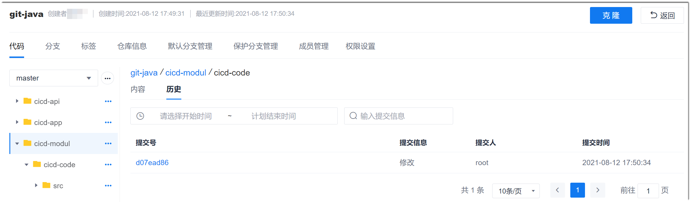

# 查看代码提交记录

您可以查看代码库中代码的提交历史，追溯提交来源。

### 前提条件
* 已使用具有代码库“代码库查看”权限，且已成为代码库成员的账号登录系统。

### 操作步骤
1. 在代码库列表中，单击仓库名称，进入仓库详情页面。
2. 单击“代码”页签。
3. 在右侧页面中，单击“历史”页签。               
   下方显示提交的历史记录，按提交时间倒序排列。其中，“提交号”为系统随机生成。              
    
    
4. 单击提交号，可以查看具体提交内容。            
   
    
 
    