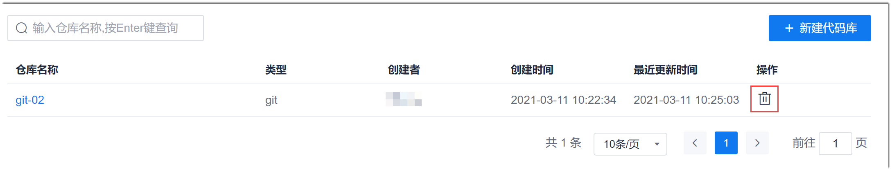

# 删除代码仓库

在代码仓库被废弃后，您可以删除代码仓库，减少冗余数据，节省云存储空间。
### 前提条件
* 已创建代码仓库。
* 已使用具有代码库“删除代码库”权限，且已成为代码库成员的账号登录系统。

### 背景信息

> [!NOTE]
> 代码库删除成功后，代码库中的所有数据也一并被删除，并且不可恢复，请谨慎操作。

### 操作步骤
1. 在代码库列表中，单击仓库“操作”列的。                    
                   
2. 在弹出的确认对话框中，单击“确定”。
     