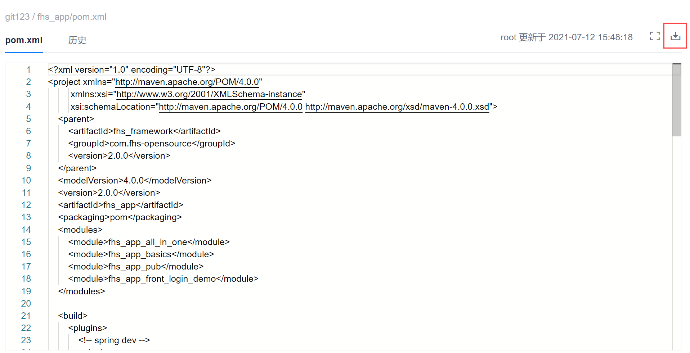

# 下载代码文件

您可以将代码库中的文件下载到本地。

### 前提条件
* 已使用具有代码库“文件管理”权限，且已成为代码库成员的账号登录系统。

### 操作步骤
1. 在代码仓库列表中，单击仓库名称。
2. 选择“代码”页签，然后在下方选择分支。               
     下方显示分支中的内容，包含文件和文件夹。                         
     
3. 打开文件夹，单击要下载的代码文件。                       
  弹出文件预览对话框，显示文件内容。                
4. 在页面右侧，单击，下载文件到本地。      
     

