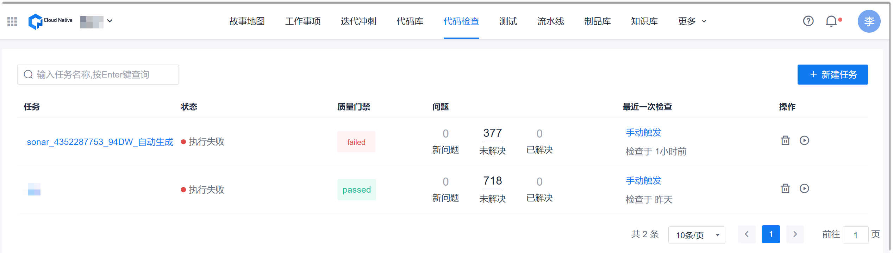
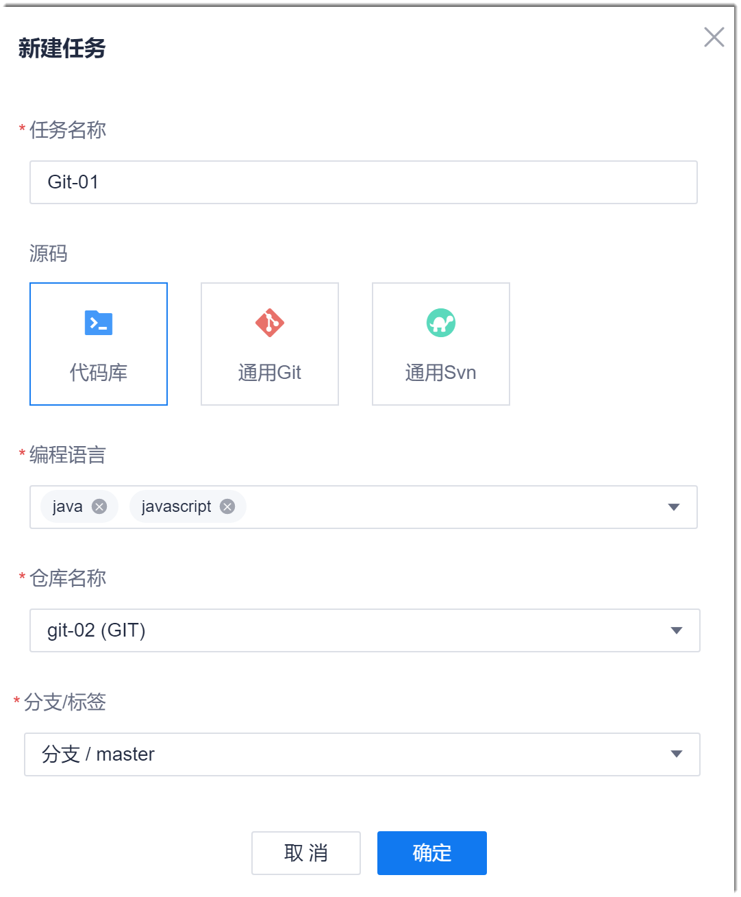

# 创建代码检查任务

您可以基于Git代码库和SVN代码库创建代码检查任务。代码仓库可以是系统云端的代码仓库，也可以是Git或SVN服务器上的代码仓库。

### 前提条件
* 已使用具备项目“新建代码检查任务”权限的账号登录系统。
* 已获取代码库的地址和认证账号密码。

### 背景信息         
代码检查任务创建成功后，默认选中所有支持语言的预置规则集进行检查。您也可以在任务创建成功后，重新设置任务使用的规则集，详细请参见[设置任务使用的规则集](10.3.5-set-rule-cluster-for-task.md)。

### 操作步骤
1. 在项目顶部菜单栏中，单击“代码检查”。            
     显示代码检查任务列表。                   
     
     
2. 在界面右上方，单击“新建任务”。
3. 在“新建任务”对话框中，根据下表的描述，填写相关参数，单击“确定”。
  
  
|参数名称|说明|
|:--------- |:-------- |
|任务名称|自定义任务名称。|
|源码|选择Git或SVN代码库。| 
|编程语言|检查代码中包含的语言，可多选。|
|仓库名称|代码仓库的名称，或者HTTP或HTTPS地址。| 
|分支/标签|选择Git仓库时有效。检查的代码分支或者标签。|
|用户名|源码为通用Git或通用Svn时有效。能访问代码仓库的用户名。|
|密码|源码为通用Git或通用Svn时有效。“用户名”对应的密码。|
> [!NOTE]
> 上表中的参数名称根据选择的“源码”不同，会有差异，但含义相同。