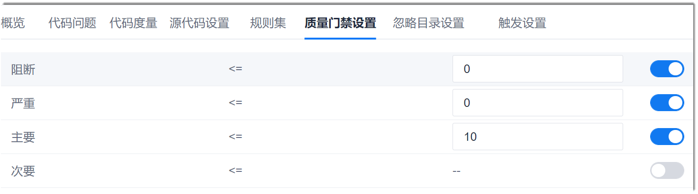

# 设置质量门禁

根据质量要求设置门禁阈值，超过阈值将提示门禁结果Failed。

### 前提条件
* 已使用具有项目“代码检查 > 任务基本信息设置”权限的账号登录系统。
* 已创建代码检查任务。

### 操作步骤
1. 在代码检查任务列表中，单击任务名称，进入任务详情界面。
2. 单击“质量门禁设置”页签。                      
    显示门禁设置界面。
                             
3. 在质量门禁设置界面中，将问题级别的开关置为ON（蓝色），然后在开关前面的文本框中，输入对应的问题个数。设置完成后，单击“保存”。                            
     此质量门禁的含义为：判断检查出的<问题级别>对应的问题数：如果大于设置的值，则检查结果为Failed；如果小于等于设置的值，则检查结果为Success。                                     
     当设置了多个门禁时，只要有一个门禁为Failed，则检查结果为Failed。

