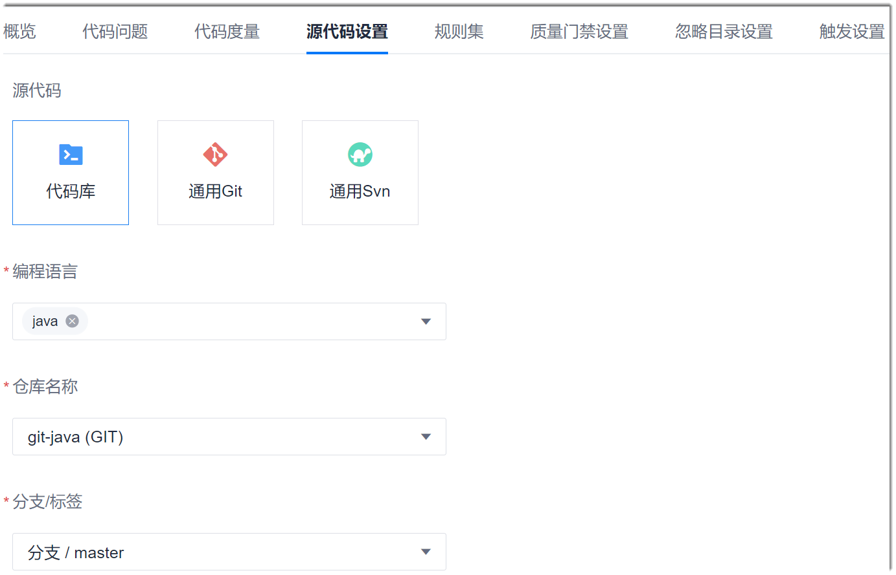

# 设置源代码

代码检查任务在创建成功后，也可以重新设置检查的源代码。

### 前提条件
* 已使用具有项目“代码检查 > 任务基本信息设置”权限的账号登录系统。
* 已创建代码检查任务。

### 操作步骤
1. 在代码检查任务列表中，单击任务名称，进入任务详情界面。
2. 单击“源代码设置”页签。          
  显示当前的源代码信息。       
        
   
3. 根据实际情况，设置源代码库类型、编程语言、仓库和分支，单击“保存”。
 