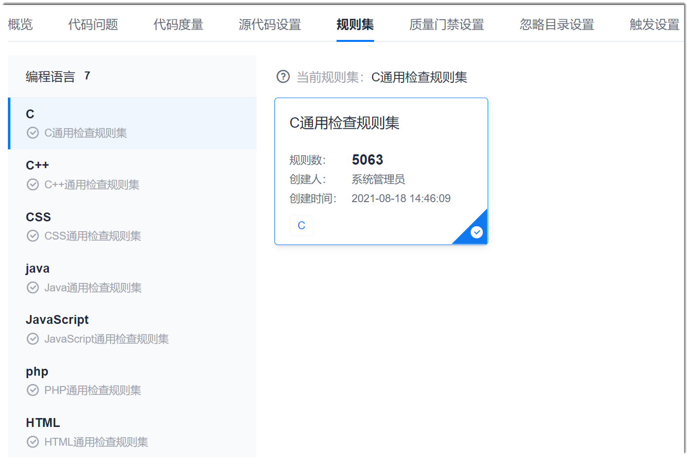

# 设置任务使用的规则集

您可以在代码检查任务创建完成后，重新设置任务使用的规则集。

### 前提条件
* 已使用具有项目“代码检查 > 任务基本信息设置”权限的账号登录系统。

### 操作步骤
1. 在代码检查任务列表中，单击任务名称，进入任务详情界面。
2. 单击“规则集”页签。          
3. 根据实际情况，单击左侧的编码语言，然后在右侧勾选该语言下的规则集。       
  您可以为多种语言选择规则集，每种语言只能选择一个规则集。           
  您可以单击规则集的名称，查看规则集的详情。      
             

系统自动保存设置。设置成功后，下一次检查启用新的规则集。

