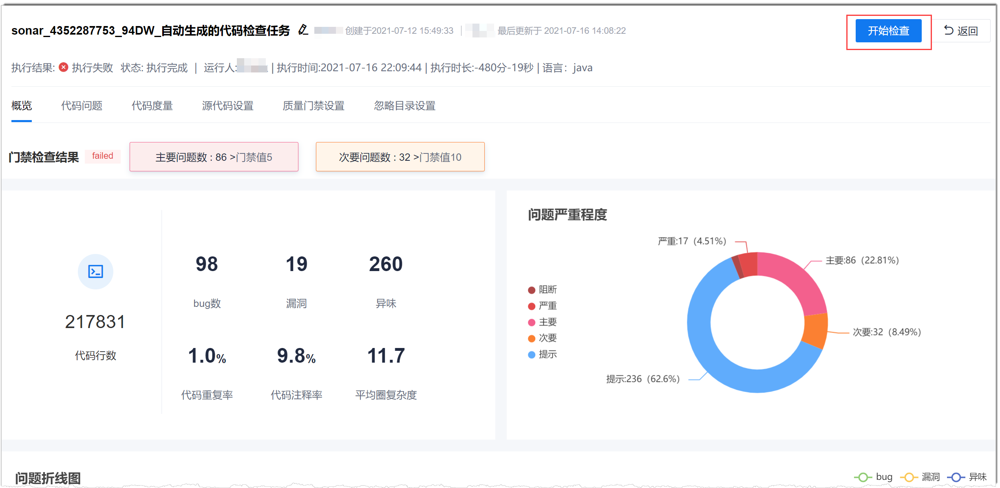

# 执行代码检查任务

在完成代码检查任务的配置后，您可以手动执行一次代码检查任务，验证代码检查是否符合预期。

### 前提条件             
* 已使用具有项目“代码检查 > 执行检查”权限的账号登录系统。
* 已创建代码检查任务，并完成代码检查任务的相关配置。

### 背景信息                 
代码检查任务可以手动执行，也可以将任务添加到流水线，由流水线触发执行。                       
推荐把代码检查任务配置在流水线中，作为流水线的一个质量门禁项，随着流水线的执行而执行。                              
此外，建议团队在分支合并前，先执行该分支的代码检查，确保合入主干的代码质量。

### 操作步骤              
1. 在代码检查任务页面，单击任务名称，进入代码检查详情界面。                  
2. 单击右上角的“开始检查”。                              
      

执行检查后，“开始检查”按钮变为“立即停止”按钮。检查结束后，代码检查概览页面会显示最新的检查结果，同时，“立即停止”按钮变回“开始检查”按钮。