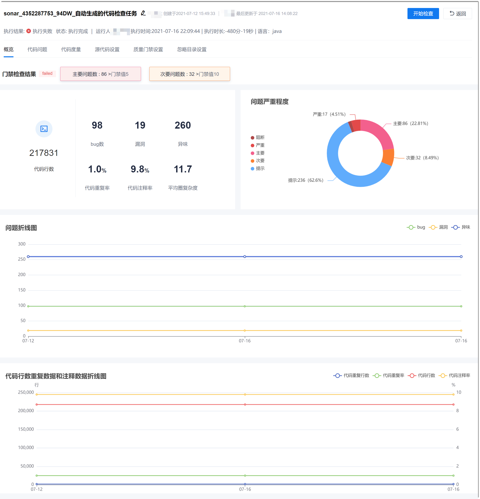
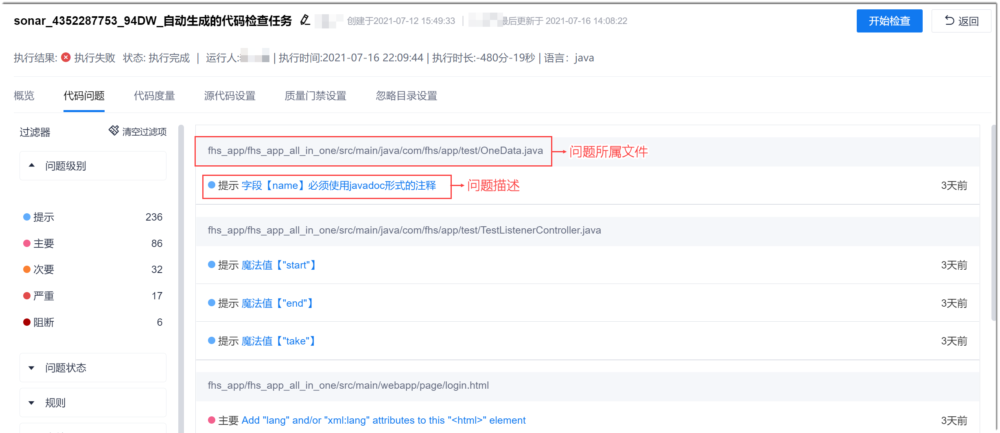
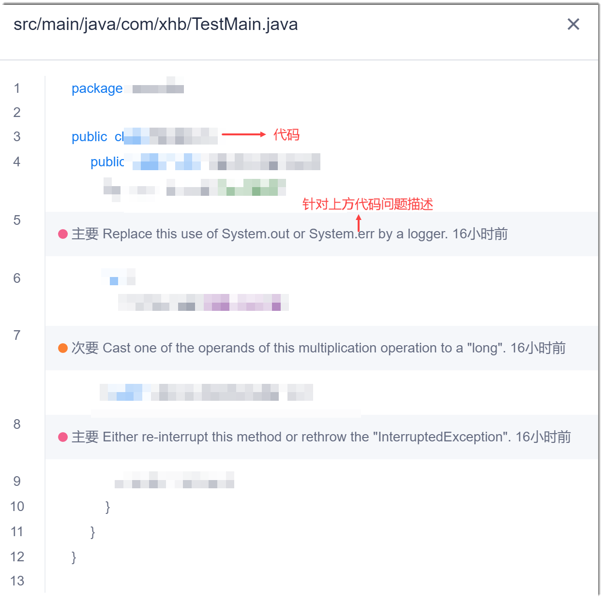
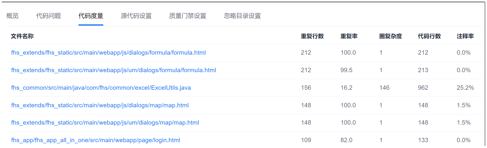
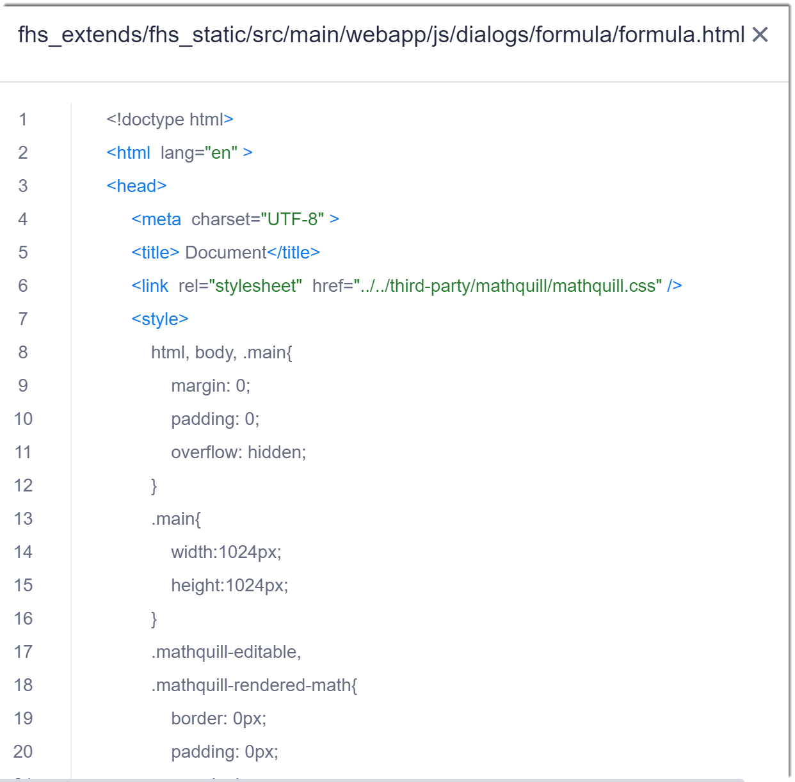

# 查看并处理检查结果

您可以通过系统查看代码检查结果的统计数据（概览）、查看具体问题及其详情（代码问题）、代码度量数据，并根据问题提示，修改问题。

### 前提条件
* 代码检查任务已执行成功。

### 背景信息             
代码检查结果中的名词沿用Sonar的术语定义，详细请参见[Sonar官方文档-名词定义](https://docs.sonarqube.org/latest/user-guide/concepts/)。代码检查结果的名词与Sonar术语对应关系如下所示：
* bug数：对应Sonar中的Bug。
* 漏洞：对应Sonar中的Vulnerability。
* 异味：对应Sonar中的Code Smell。

代码检查的问题严重程度，请参见[Sonar问题定义](https://docs.sonarqube.org/latest/user-guide/issues/)。

### 查看统计数据
在代码检查任务详情界面中，单击“概览”页签，显示检查结果的统计数据。                                   

### 查看代码具体问题                
在代码检查任务详情界面中，单击“代码问题”页签，左侧显示问题分类，右侧默认显示所有问题。                                 
您可以单击左侧的分类，根据不同维度筛选问题。您可以同时选择多个维度进行筛选，但同一个维度下只能选择一个筛选项。如果想取消该维度的筛选，单击维度标题上的。                                                       

在右侧界面中，单击问题，可查看问题代码的上下文。                          

### 查看代码度量                   
在代码检查任务详情界面中，单击“代码度量”页签，显示相关代码文件的度量数据，包括：重复行数、重复率、圈复杂度、代码行数、注释率。          

单击代码文件，可打开文件，查看文件内容。    

### 处理问题                  
根据检查结果的提示，修改相关问题。修改完成后，可再次执行检查，验证修改结果。