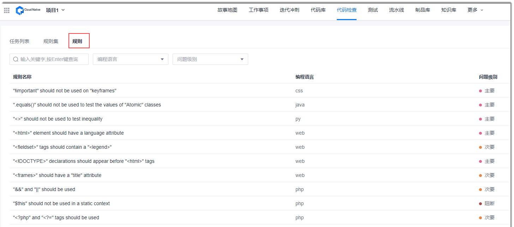
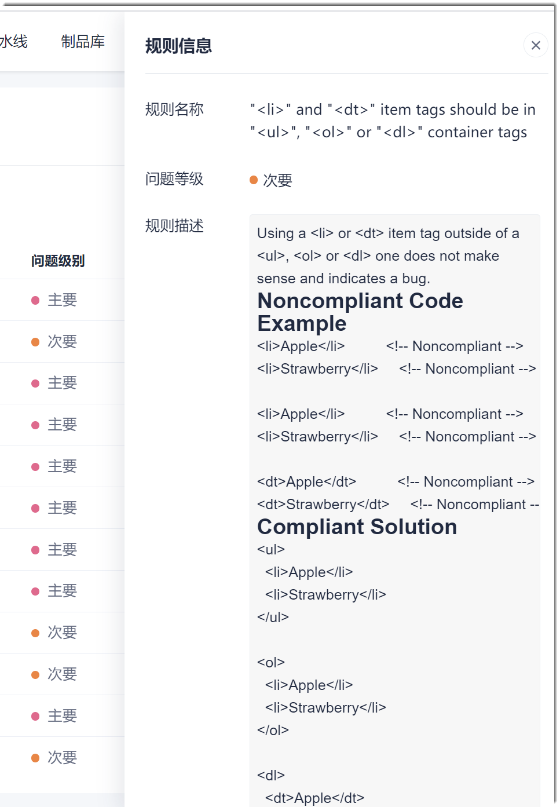

# 查看检查规则

您可以查看规则详情，从而确定是否将规则纳入规则集中，作为实际检查规则。

### 操作步骤
1. 在项目顶部菜单栏中，单击“代码检查”。         
  界面默认显示代码检查任务列表页签。     
2. 在界面左上方，单击“规则”页签。       
  界面显示系统预置的规则列表。           
          
3. （可选）您可以在列表上方，根据关键字搜索规则，或者根据编程语言和问题级别筛选规则。         
4. （可选）在规则列表中，单击规则名称，查看规则详情。        
  

