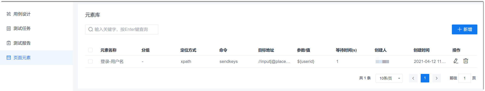
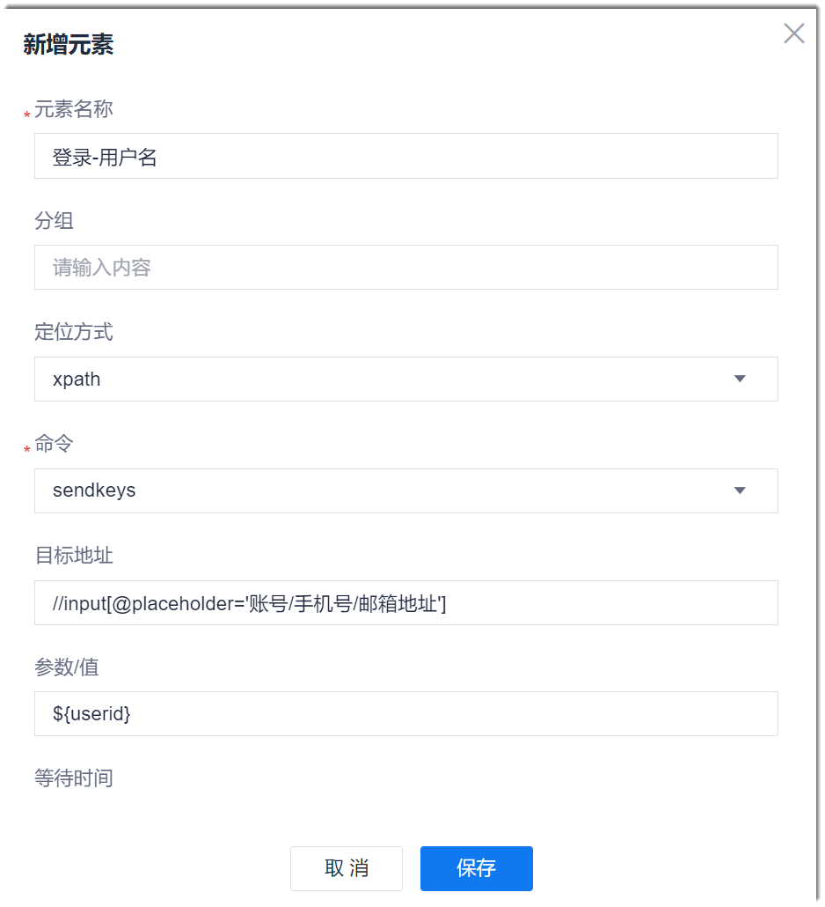

# 管理页面元素

页面元素用于统一管理UI界面的测试方式。创建页面元素后，您可以在[创建UI测试用例](11.2.1.1-create-ui-test-case.md)的测试步骤时，直接关联页面元素。避免同一UI测试步骤在不同用例中重复编写，提升测试脚本编写效率。

### 创建页面元素
1. 在项目顶部菜单栏中，单击“测试”。                
    进入测试管理界面。                     
2. 在左侧导航栏中，单击“页面元素”。                        
    右侧界面显示已创建的页面元素。      
   
3. 在界面右上方，单击“新建”。
4. 在“新建元素”对话框中，设置参数，单击“保存”。      
                        
    参数填写说明如下表所示。
    
          
     <table>
<tr>
    <th>参数</th>
    <th>说明</th>
</tr>
<tr>
    <td>元素名称</td>
    <td>自定义元素名称，支持2~50个非空格字符。</td>
</tr>
<tr>
    <td>分组</td>
    <td>自定义分组，支持2~50个非空格字符。</td>
</tr>
<tr>
    <td>定位方式</td>
    <td>选择定位到界面位置的方式。</td>
</tr>
<tr>
    <td>命令</td>
    <td>选择执行操作的命令。例如，需要输入信息，则选择“sendkeys”。</td>
</tr>
<tr>
    <td>目标地址</td>
    <td>根据定位方式，输入定位到元素的表达式。例如，定位方式采用XPath，则采用XPath的元素定位表达式。</td>
</tr>
<tr>
    <td>值/参数</td>
    <td>值是一种测试数据。根据命令确定是否需要设置值。值可以直接指定（适用于一个步骤只需要输入一个测试数据的场景），也可以通过参数的形式获取（适用于对于同一个步骤需要输入多个测试数据的场景）。
采用参数获取值时，使用“${_自定义参数名称_}”的方式。在此处自定义参数后，UI测试用例中会显示“测试数据”区域，用于设置各场景下各参数的取值。
</td>
</tr>
<tr>
    <td>等待时间</td>
    <td>表示执行此步骤后，是否需要等待一定时间（单位为秒）再执行下一个步骤。不设置，表示不等待。</td>
</tr>
</table>

元素创建成功后，返回元素列表界面。界面显示新建的元素。

### 修改/删除页面元素
在元素列表中，单击元素后面的或，可修改或删除页面元素。
    