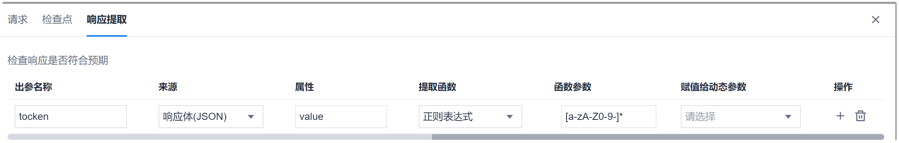

# 设置响应提取

响应提取是将接口响应结果的某一部分提取出来命名为参数，供当前用例的后续步骤调用。

### 响应提取参数的使用范围和使用方式          
后续步骤的接口地址、URL参数、检查点的目标值均可以引用响应提取的参数。            
引用格式为**${_参数名_}**。

### 操作步骤
在步骤编辑界面中，单击“响应提取”页签，设置响应提取的信息。                
         
响应提取的内容说明如下表所示。

|参数|说明|
|:--------- |:-------- |
|出参名称|自定义参数名称。|
|来源|表示提取接口返回的哪一类信息。取值为系统预置参数，详细请参见[响应提取预置参数说明](#响应提取预置参数说明)。|
|属性|表示提取接口返回信息中的哪个字段的取值。如果来源为响应码，属性可不填。如果来源为响应体或响应头中的字段，字段支持嵌套取值，例如“result.status”。|
|提取函数|表示将“来源”的“属性”通过哪种方式提取出来，作为出参取值。例如：将“响应体”中的“value”属性通过“正则表达式”的方式提取出来。|
|函数参数|表示具体的提取函数。|
|赋予给动态参数|如果需要将此提取的参数值供项目中的其它用例调用，则可以勾选此参数，将提取值赋予给全局参数的动态参数|
|操作|：增加一个响应提取。 ：删除一个响应提取。|

### 响应提取预置参数说明               
检查点预置参数如下表所示。

|参数|参数说明|属性是否支持多级取值|举例|
|:--------- |:-------- |:-----|:---|
|响应体(JSON)|接口返回的响应体。|是|**含义**：判断响应体中的id等于100。 **设置**：“来源”为“响应体（JSON）”，“属性”为“id”（前提：响应体JSON串中有“id”字段），“比较符”为“等于（字符串、不区分大小写）”，“目标值”为“100”。|
|响应码|接口返回的响应头。|是|**含义**：判断响应头中的token等于abcd。 **设置**：“来源”为“响应头”，“属性”为“token”（前提：响应头有token），“比较符”为“等于（字符串、不区分大小写）”，“目标值”为“abcd”。|
|响应头|接口返回的响应码。|否|**含义**：判断响应码等于200。 **设置**：“来源”为“响应码”，“比较符”为“等于（数字）”，“目标值”为“200”。|
> [!NOTE]
> 内置参数支持多级取值，例如：响应体为“{"result":{"appId":12}}”时，则取appId的属性格式为“result.appId”。如果result是数组格式，则属性为“result[i].appId”，其中，i为非负整数。
