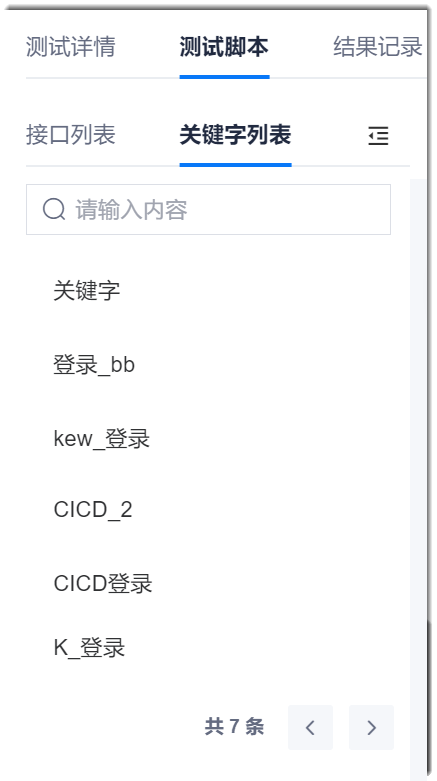
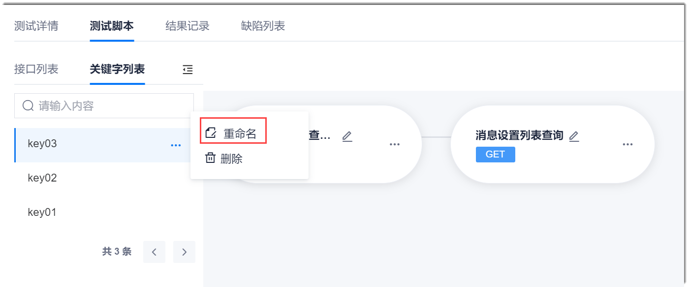

# 设置关键字

测试关键字来源于关键字驱动的测试方法，是特殊类型的测试用例。测试关键字用于封装常用测试逻辑，可以被多个测试用例调用，实现逻辑复用。

在测试设计时，经常会遇到有一些相同的前置步骤或者测试逻辑。如果每一个测试用例中都编写这些步骤，重复工作量很大，并且难以维护。测试关键字可以帮助复用这些测试步骤。

### 创建关键字
1. 在测试脚本界面中，单击“创建关键字”。
2. 在下方界面中，输入关键字名称（关键字名称在同一用例内需唯一），勾选需要添加到关键字的步骤，单击“确定”。
    

关键字创建成功后，单击“ > 关键字列表”，可以查看新创建的关键字。    
 

### 重命名关键字 
1. 在关键字列表中，单击关键字后面的“ > 重命名”。       
   
  
2. 在弹出的对话框中，设置新名字，单击“确定”。

### 删除关键字       
1. 在关键字列表中，单击关键字后面的“ > 删除”。           
   
  
2. 在弹出的确认框中，单击“确定”。