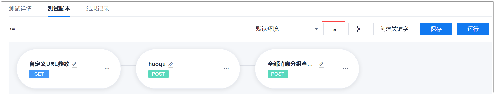
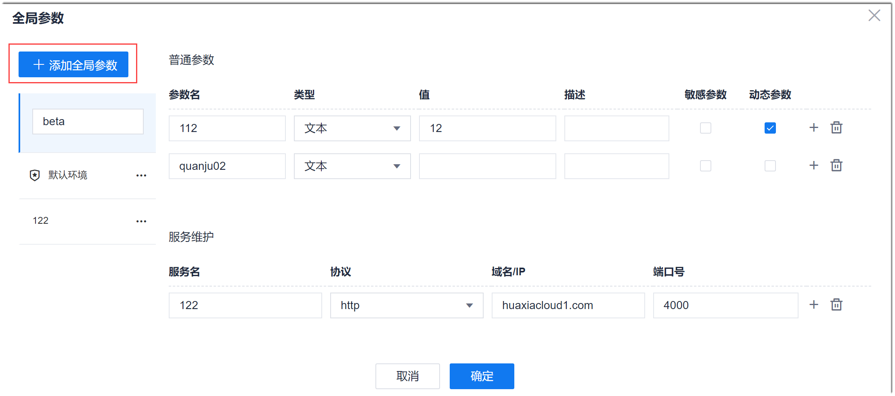
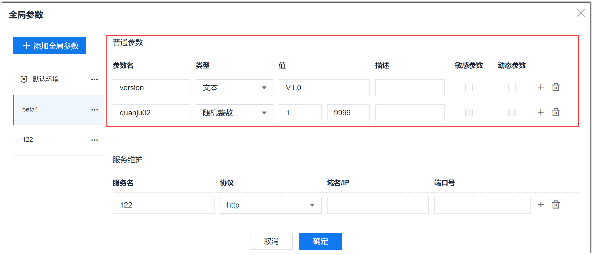

# 设置全局参数

全局参数包括测试环境的服务地址和适用于整个项目的普通参数。                   
在自动化测试中，通常存在多个测试环境，每个测试环境的服务地址不同，例如域名、端口号；每个测试环境的参数也可能不同，例如账号、密码。这些参数常会在测试脚本中被使用到。如果将这些参数直接写到测试脚本中，脚本的冗余度很高，复用度很低。                       
为了解决上述问题，可以采用全局参数的方式，统一管理与环境相关的参数。在测试脚本中参数化引用这些参数。

### 使用范围和使用方式                
本项目测试用例的测试步骤中的接口地址、URL参数、检查点的目标值均可以引用全局参数。                           
引用格式为：
* 全局动态参数：**@{_参数名_}**
* 全局非动态参数：**${_参数名_}**

### 操作步骤                              
1. 在测试脚本编辑界面中，单击。
     
2. （可选）添加环境。                          
     系统默认有一个名为“默认环境”的环境。您可以添加多个环境，也可以将新添加的环境设置为默认环境，有可以修改环境名称、删除环境。
   1. 在左侧环境列表区域中，单击“添加全局参数”。
   2. 在下方文本框中输入环境的名称。                  
   
  
  添加环境时， 如果右侧有显示普通参数和服务地址信息，会默认将显示的普通参数和服务地址信息的一些信息带入新建的环境中。                     
  环境添加完成后，您也可以修改环境名称、删除环境、将环境设置为默认环境：单击环境后面的，选择相应的操作。                       
3. 设置环境中普通参数。                      
   在环境列表中单击环境名称，右侧界面显示当前环境下的普通参数和服务地址信息。在“普通参数”区域中，设置参数的信息。
   
    <table>
<tr>
    <th>参数</th>
    <th>说明</th>
</tr>
<tr>
    <td>参数名 </td>
    <td>自定义参数名称，最多支持32个字符，字符支持中英文、数字、以及“_”、“-”、“.”。</td>
</tr>
<tr>
    <td>类型</td>
    <td>表示参数的类型：<ul><li>文本：最多输入256个字符。</li><li>随机字符串：随机生成“值”位数的字符串。</li><li>随机整数：随机生成“值”区间范围内的整数。</li></ul></td>
</tr>
<tr>
    <td>值</td>
    <td>根据参数类型设置参数值。</td>
</tr>
<tr>
    <td>描述</td>
    <td>对参数的描述信息。</td>
</tr>
<tr>
    <td>敏感参数</td>
    <td>只对“文本”类型的参数有效。勾选后，系统会将参数值密文显示。</td>
</tr>
<tr>
    <td>动态参数</td>
    <td>勾选后，“响应提取”的参数可以引用，引用后，“响应提取”的参数值将赋予此动态参数。</td>
</tr>
<tr>
    <td><i>操作</i></td>
    <td>：增加一个参数。 ：删除一个参数。</td>
</tr>
</table>

4. 设置环境中的服务地址信息。                         
  在环境列表中单击环境名称，右侧界面显示当前环境下的普通参数和服务地址信息。在“服务维护”区域中，设置服务的信息。
    <table>
<tr>
    <th>参数</th>
    <th>说明</th>
</tr>
<tr>
    <td>服务名 </td>
    <td>自定义服务环境的名称，最多支持32个字符。</td>
</tr>
<tr>
    <td>协议</td>
    <td>服务使用的协议，包括HTTP和HTTPS。</td>
</tr>
<tr>
    <td>域名/IP</td>
    <td>服务的域名或者IP地址。</td>
</tr>
<tr>
    <td>端口号</td>
    <td>提供服务的端口号。</td>
</tr>
<tr>
    <td><i>操作</i></td>
    <td>：增加一个服务地址信息。 ：删除一个服务地址信息。</td>
</tr>
</table>

5. 设置完成后，单击界面下方的“确定”。

