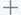

# 设置局部参数

局部参数适用于当前用例。

### 使用范围和使用方式
本用例中的测试步骤的接口地址、URL参数、检查点的目标值均可以引用局部参数。             
引用格式为**#{_参数名_}**。

### 操作步骤
1. 在测试脚本编辑界面中，单击。
     
2. 设置局部参数。
   在“局部参数”对话框中，设置参数信息，单击“确定”。
   
   
|参数|说明|
|:--------- |:-------- |
|参数名|自定义参数名称，字符支持中英文、数字、以及“_”、“-”、“.”。|
|类型|表示参数的类型：<ul><li>文本：最多输入256个字符。</li><li>随机字符串：随机生成“值”位数的字符串。</li><li>随机整数：随机生成“值”区间范围内的整数。</li></ul>|
|值|根据参数类型设置参数值。|
|描述|对参数的描述信息。|
|敏感参数|只对“文本”类型的参数有效。勾选后，系统会将参数值密文显示。|
|_操作_|：增加一个参数。 ：删除一个参数。|

