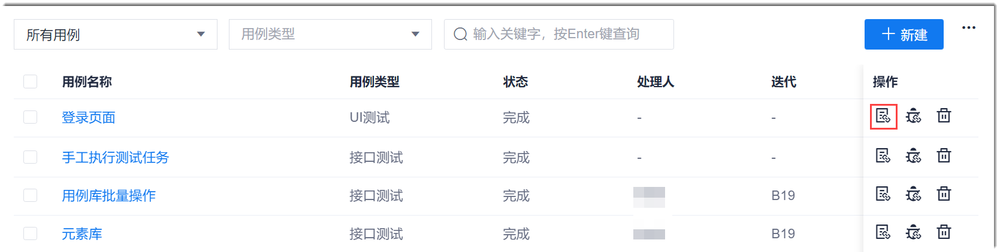
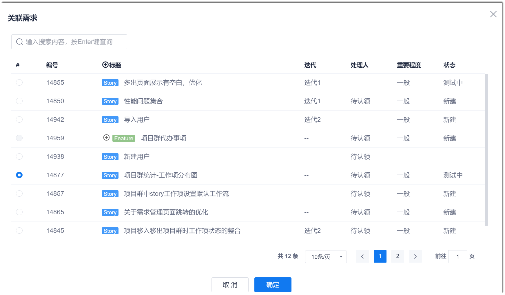
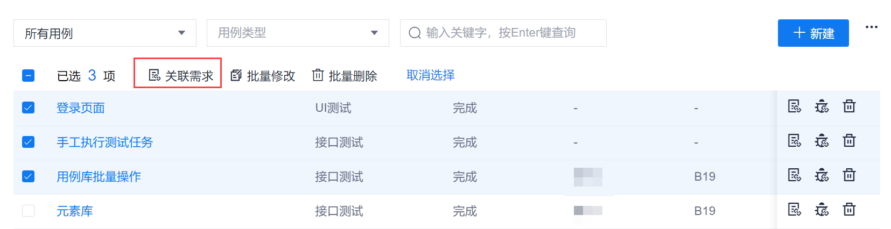
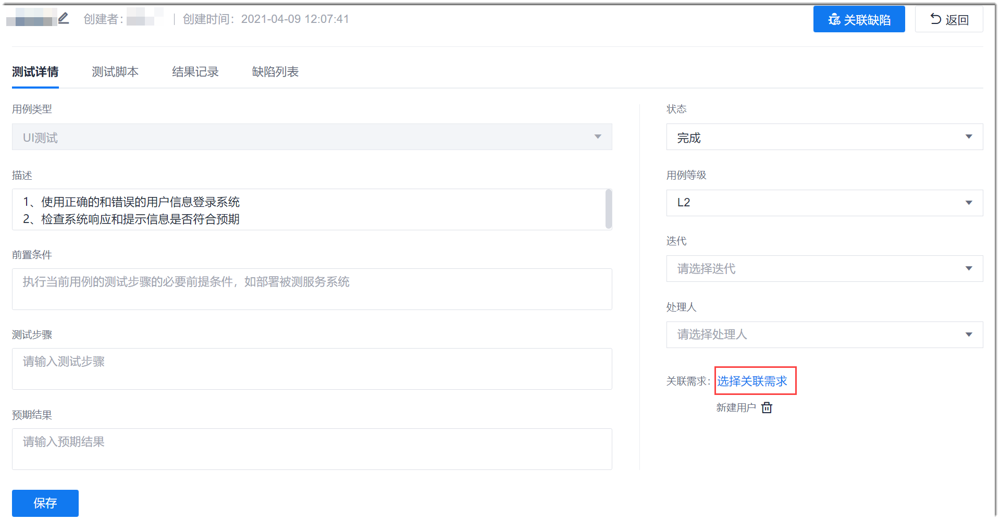

# 用例关联需求

测试用例与需求相关。为了端到端管理需求的实现过程和情况，您可以将用例与Story类型的需求关联。

### 操作步骤                 
您可以通过以下三种方式关联Story：
* **通过用例库为单个用例关联Story**
  1. 在用例库页面中，单击用例“操作”列的。
              
  2. 在弹出的“关联需求”对话框中，选择相关联的Story，单击“确定”。
    
  
* **通过用例库批量关联Story**
  1. 在用例库页面中，选中需要关联同一个Story的测试用例，单击上方的“关联需求”。
                    
  2. 在弹出的“关联需求”对话框中，选择相关联的Story，单击“确定”。

* **通过用例详情为单个用例关联Story**
  1. 在用例库页面中，单击用例名称，进入用例详情页面。
  2. 单击页面右下角的“选择关联需求”。
                   
  3. 在弹出的“关联需求”对话框中，选择相关联的Story，单击“确定”。

需求关联成功后，在用例库页面中，用例的“关联需求”列会显示“已关联”。单击“已关联”，可查看被关联的需求详情。