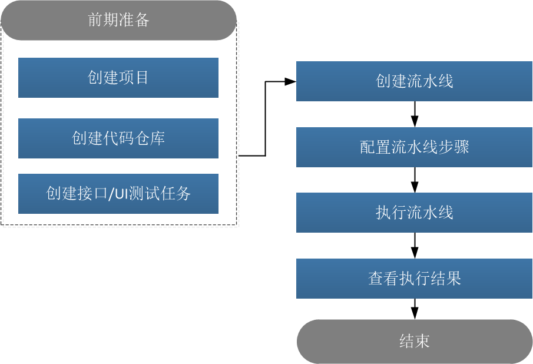

# 流水线概述

流水线提供灵活易用的构建自动化、集成自动化、验证自动化、部署自动化功能，完成从开发到上线过程的持续集成、持续部署、 持续交付。同时，通过持续向团队提供及时反馈，让交付过程高效顺畅。                 
流水线支持流程自定义编排，通过代码检查、构建、部署、文件上传、测试、管控等组件化能力，把从开发到交付的各项工作串联起来，从而让企业轻松地实现持续交付 。

### 相关概念
* **代码源**：持续交付的代码库，包括系统仓库、通用Git仓库、通用SVN仓库。
* **阶段**：在流水线中需要按顺序执行的一组任务的集合。阶段之间串行执行。
* **任务**：在阶段中需要完成的一组步骤的集合。 
* **步骤**：步骤是需要完成的具体动作。所有的流水线都是通过步骤的编排组合而成的。目前支持的步骤包含：代码检查、构建、 部署、文件上传、测试、人工执行脚本、人工审核、延迟执行。

### 功能特性                  
本系统的流水线具备如下功能特性。                   

|功能特性|说明|
|:--------- |:-------- |
|一键创建流水线|系统根据编程语言预置不同目的的流水线模板，并可自定义模板。创建流水线时，可选择模板，一键创建流水线。|
|自定义流水线模板|系统根据编码语言和目的预置流水线模板，也支持将当前流水线保存为模板，或者全新创建模板，便于后续使用。|
|流水线自定义编排|可根据项目需要，自定义流水线的阶段、任务和步骤。|
|流水线任务支持串并行执行|流水线任务支持串行编排，也支持并行编排，提升流水线执行效率。|
|支持多种步骤类型|支持代码检查、构建、部署、文件上传、测试、人工执行脚本、人工审核、延迟执行等多种任务类型。|
|流水线参数化执行|流水线支持自定义参数，在流水线步骤中引用，实现步骤和数据分离。也支持在执行时由用户指定参数值，任务使用指定值替换相应参数执行。|
|任务延迟执行|当后续任务依赖的多个任务不能同时执行完成时，可以使用延迟执行步骤，确保后续任务能成功执行。|
|流水线定时执行|流水线可以根据您定义的时间，自动执行。| 
|支持执行历史记录|系统记录流水线的历史执行情况，供用户查看。|
|成员和权限独立管理|各流水线的成员和权限独立管理，充分保障流水线的访问安全。|
|消息通知|您可以定义流水线的事件发生后，通过邮件通知流水线创建者和执行者。|

### 流水线基本操作流程                     
通过创建一条简单的流水线，介绍配置流水线的前置准备工作及基本操作流程，帮助您快速建立对流水线的整体印象。      
在简单流水线的基础上，您可以根据实际情况设置流水线参数、设置执行计划、设置webhook等。当流水线执行结果有问题时，通过执行结果提示，处理问题。                       

