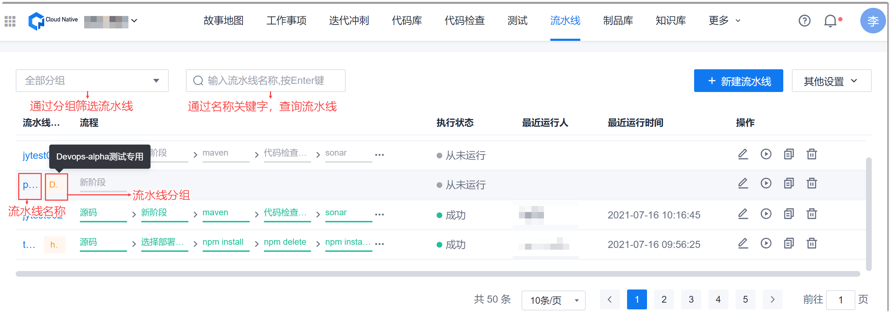
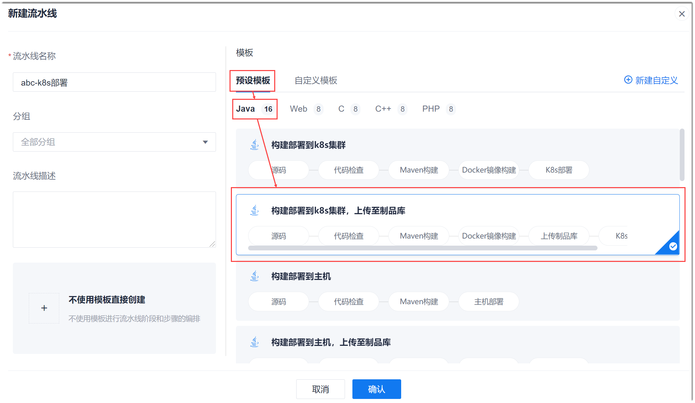
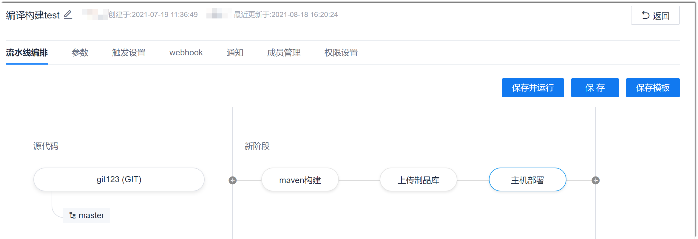
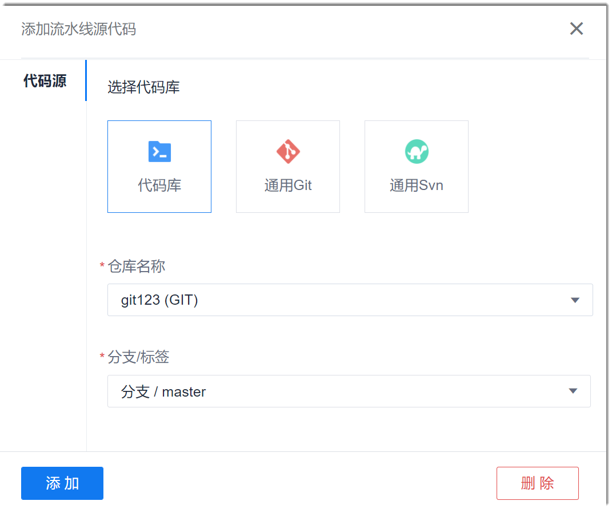
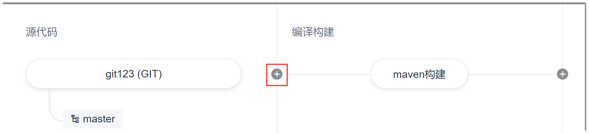
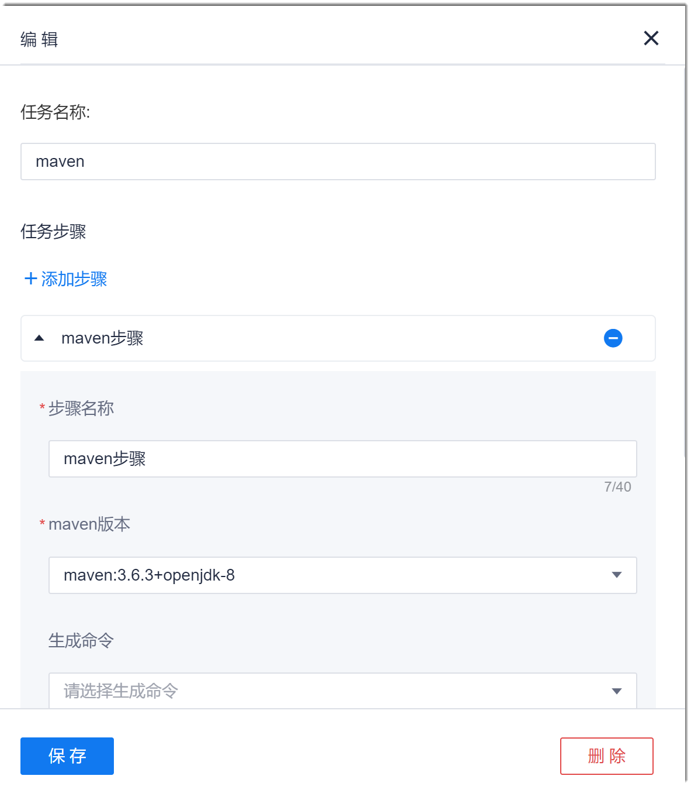
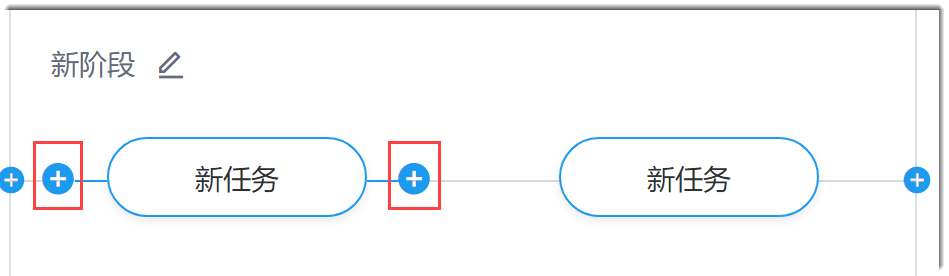
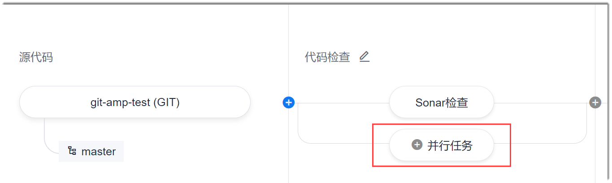

# 创建流水线

### 前提条件
* 已使用具有项目“流水线 > 新建流水线”权限的账号登录系统。
* 已确定代码仓库的地址、分支和认证信息。
* 流水线依赖的环境，例如K8s集群，已部署成功。
* 流水线的前置任务，例如代码检查任务，已创建完成。

### 背景信息      
流水线使用的代码源可以来自于系统的代码库，也可以来自于其它Git或SVN仓库。

### 操作步骤
1. 在项目顶部菜单栏中，单击“流水线”。                
     显示流水线列表界面。                          
                    
2. 单击右上角的“新建流水线”。
3. 在弹出的“新建流水线”对话框中，执行如下操作：       
  1. 在左侧区域中，设置流水线名称、分组和描述。    
    其中，“流水线名称”支持最多32个由字母、数字、中文、“-”、“_”组成的字符串，且必须以字母或中文开头。
  2. （可选）如果创建空白流水线，则选中“不使用模板直接创建”。
  3. （可选）如果使用模板创建流水线，则在右侧区域中，选择模板类型页签，然后选择编码语言，再选择对应的模板。
  4. 设置完成后，单击“确定”。
按照下表的描述设置参数，单击“确认”。                     
                        
   系统显示该流水线的编排页面。您需要在流水线编排页面中编排流水线。                 
                
4. 编排流水线。
  1. 设置代码源。            
    在流水线编排页面中，单击“添加代码源”，然后在右侧“添加流水线源代码”对话框中，设置相关参数，单击“添加”。            
     
     <table>
<tr>
    <th>仓库类别</th>
    <th>参数</th>
    <th>说明</th>
</tr>
<tr>
    <td>所有仓库类别 </td>
    <td>选择代码库 </td>
    <td>当前支持3种代码库：代码库（系统代码库）、通用Git（任意Git代码库）、通用SVN（任意SVN代码库）</td>
</tr>
<tr>
    <td rowspan="2">代码库 </td>
    <td>仓库名称</td>
    <td>从下拉列表中选择。如果下拉列表无值，则表示系统中无代码库。</td>
</tr>
<tr>
    <td>分支/标签</td>
    <td>从下拉列表中选择分支或者标签。下拉列表取值为代码库中的所有分支或者标签。</td>
</tr>
<tr>
    <td rowspan="2">通用Git/通用SVN</td>
    <td>仓库名称</td>
    <td>实际仓库的名称。</td>
</tr>
<tr>
    <td>代码仓库地址</td>
    <td>实际代码仓库的HTTP或HTTPs地址。</td>
</tr>
<tr>
    <td>通用Git</td>
    <td>分支/标签</td>
    <td>选择代码仓库中的分支或者标签名称。设置后，系统对该分支或者标签的内容执行流水线。</td>
</tr>
<tr>
    <td rowspan="2">通用Git/通用SVN</td>
    <td>用户名</td>
    <td>能访问代码仓库的用户名。</td>
</tr>
<tr>
    <td>密码</td>
    <td>能访问代码仓库的密码。</td>
</tr>
</table>
 
  2. 设置阶段。               
      流水线创建成功后，系统自动添加一个名为“新阶段”的阶段。您可以：
      * 修改阶段名称：鼠标移动到阶段名称上，单击。
      * 添加新的阶段：单击阶段框上的，然后修改阶段名称，并设置阶段中的任务。                        
                           
> [!NOTE]
> 如果需要删除阶段，则需删除所有任务。阶段中的所有任务均被删除后，该阶段自动被删除。删除任务：在任务编辑界面中，单击"删除“。

  3. 设置任务。                               
    添加阶段后，系统会自动添加一个名为“新任务”的任务。您可以编辑该任务，也可以新增串行的或并行的新任务。任务只能在一个阶段内并行执行，不能跨阶段并行执行。
     * 编辑任务：单击任务名称，在右侧弹出的任务编辑对话框中，设置任务的名称，然后添加步骤，并[配置流水线步骤](12.3-config-steps-in-pipeline.md)，单击“保存”。
        
> [!NOTE]
> * 如果需要删除任务，在任务编辑界面中单击“删除”。
> * 各步骤类型的配置说明请参见[配置流水线步骤](12.3-config-steps-in-pipeline.md)。
     * 添加串行的新任务：鼠标移动到任务名称上，单击两侧的。然后在右侧的任务编辑对话框中，编辑任务。        
                  
     * 添加并行的新任务：鼠标移动到阶段的区域中，单击“并行任务”，添加一个并行的新任务。然后在右侧的任务编辑对话框中，编辑任务。         
                
 
  4. 所有阶段、任务、步骤设置完成后，单击右上角的“保存”或“保存并运行”，完成流水线的编排。
    
