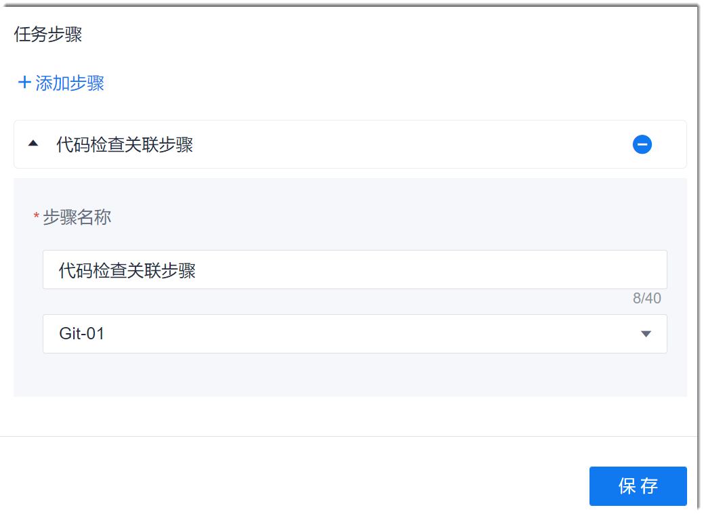

# 代码检查任务

CAP流水线中的“代码检查关联步骤”，引用“代码检查”服务中的代码检查任务。因此，在配置流水线中的“代码检查关联步骤”前，需在“代码检查”服务中创建代码检查任务。

### 操作步骤
1. 在流水线任务编辑页面中，添加“代码检查关联步骤”。
2. 配置代码检查关联步骤。           
     设置步骤名称，然后选择代码检查任务，单击“保存”。       
     

