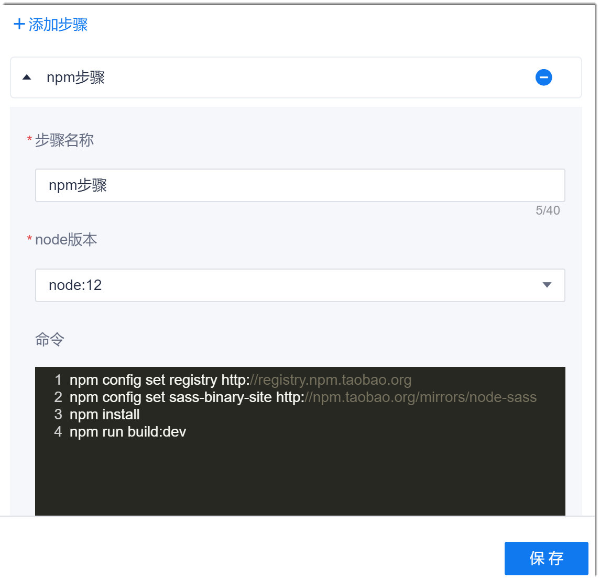

# Npm构建

Npm的全称是Node Package Manager，是一个Node包管理工具，一般用于前端程序的代码编译构建。

### 操作步骤
1. 配置Npm步骤。                        
  在流水线任务中，添加“构建 > NPM构建”步骤，设置步骤名称，选择Node版本，在命令框中输入要执行的Npm命令，然后，单击“保存”。                   
  其中，如果构建本系统的项目（即代码源选择“代码库”），“node版本”需选择“node:12”。          
               
2. 配置Npm命令。                          
    Npm常用构建命令如下所示。Npm其它命令请参见[Npm官方文档](https://docs.npmjs.com/cli/v7)。
```
    # 命令——指定下载依赖包的镜像服务器
    npm config set registry <镜像服务器地址>
    npm config set sass-binary-site <镜像服务器地址>
    # 举例——指定下载依赖包的镜像服务器为taobao镜像服务器
    npm config set registry http://registry.npm.taobao.org
    npm config set sass-binary-site http://npm.taobao.org/mirrors/node-sass
    # 下载并安装所有的依赖包
    npm install
    # 命令——打包构建并部署到环境
    npm run build:<环境名称>
    # 举例——打包构建并部署到“dev”环境
    npm run build:dev
```


