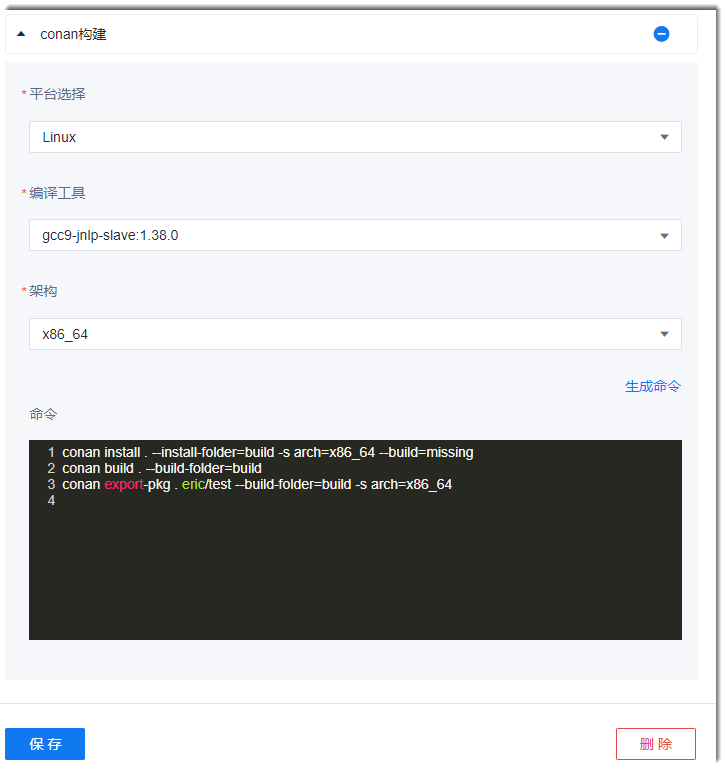

# Conan构建

Conan是一个支持多操作系统、多编译器、多构建工具、多构建方式的包管理器。目前，本系统支持Linux系统、Windows系统，X86、X86_64架构，C/C++语言的Conan构建。

### 操作步骤
1. 在流水线的任务编辑界面中，添加“构建 > Conan构建”步骤。
2. 配置Conan构建步骤。       
  在流水线任务中：
  1. 添加“构建 > Conan构建”步骤，设置步骤名称，选择“平台选择”（操作系统）、“编译工具”和“架构”。
  2. 单击“生成命令”，系统会在命令框中生成对应的构建命令。您也可以输入要执行的Conan命令。
  3. 单击“保存”。                     
> [!NOTE]
> Windows平台暂不支持ARM架构。     

   
   
关于Conan的命令请参见[Conan官方文档](https://docs.conan.io/en/latest/reference/commands.html)。