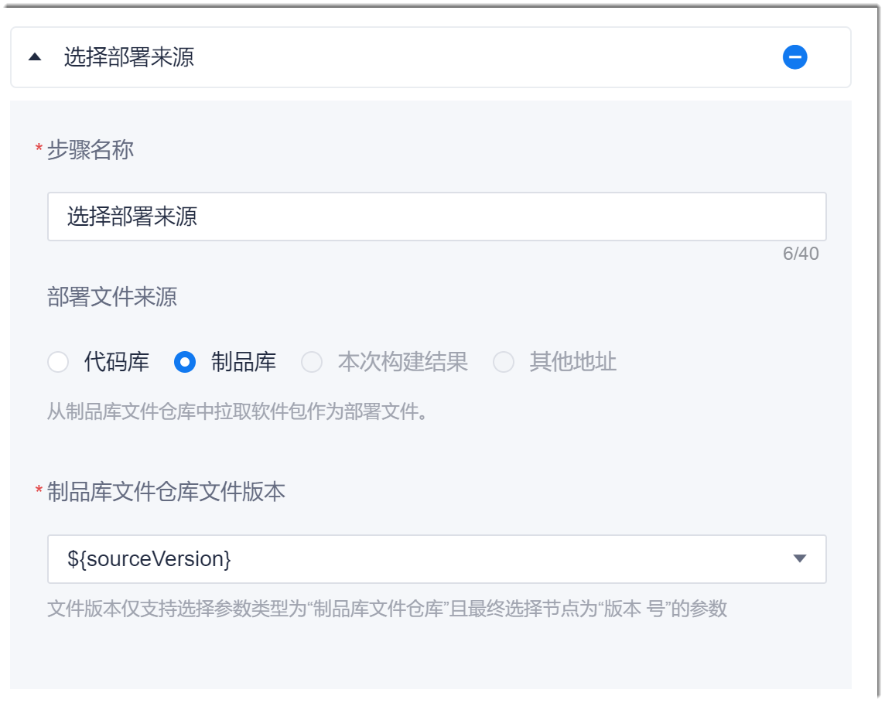

# 选择部署来源

选择部署来源即选择主机部署的部署文件从哪里来。

### 操作步骤       
1. 在流水线的任务编辑页面中，添加“部署 > 选择部署来源”步骤。
2. 配置“选择部署来源”步骤。      
  根据下表描述，配置“选择部署来源”步骤的相关参数，单击“保存”。        
  
    <table>
<tr>
    <th>参数</th>
    <th>说明</th>
</tr>
<tr>
    <td>步骤名称 </td>
    <td>自定义步骤的名称。支持最多40个字符。</td>
</tr>
<tr>
    <td>部署文件来源 </td>
    <td><ul><li>代码库：从配置的“源代码”中获取代码部署文件。</li><li>制品库：从制品库的文件仓库中拉取软件包作为部署文件。</li></ul></td>
</tr>
<tr>
    <td>制品库文件仓库文件版本</td>
    <td>“部署文件来源”选择“制品库”时，本参数有效。
从下拉菜单中选择从文件仓库中获取的版本文件。

下拉菜单的取值来源于<a href="12.6.1-set-parms.md#添加制品库文件仓库类参数">制品库文件仓库类参数</a>中的“版本号”参数。</td>
    </tr>
</table>

