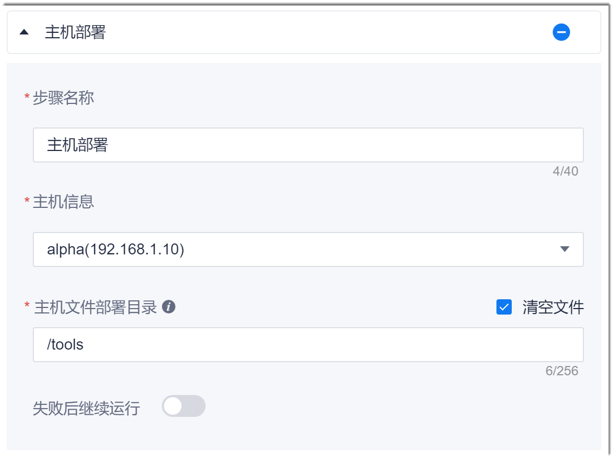

# 复制文件到主机

### 前提条件      
* 待部署的主机已经[被添加到系统中管理](6.7.2.1-new-hosts.md)。
* 如果部署来源为制品库，“制品库 > 文件仓库”中需要有对应的版本文件，并且已将该版本文件添加为“制品库文件仓库 > 版本号”类参数（参见[添加制品库文件仓库类参数](12.6.1-set-parms.md#添加制品库文件仓库类参数)）。        
  文件仓库中的版本文件来源于将代码库中的内容上传到文件仓库中的文件，详细请参见[配置构建物上传制品库步骤](12.3.8-file-upload-to-release-library.md)。

### 操作步骤
1. 在流水线的任务编辑页面中，添加“部署 > 主机部署”步骤。
2. 配置“主机部署”步骤。          
              
    <table>
<tr>
    <th>参数</th>
    <th>说明</th>
</tr>
<tr>
    <td>步骤名称 </td>
    <td>自定义步骤的名称。支持最多40个字符。</td>
</tr>
<tr>
    <td>主机信息 </td>
    <td>从下拉菜单中选择主机。主机来源于<a href="6.7.2.1-new-hosts.md">添加主机</a>中添加的主机。</td>
</tr>
<tr>
    <td>主机文件部署目录</td>
    <td>表示将文件上传到主机的哪个目录。该目录为绝对路径，且主机信息中用户对该目录必须具有可写权限。
勾选“清空文件”后，系统会自动将主机对应目录下的文件都删除。
</td>
</tr>
<tr>
    <td>主机文件部署目录</td>
    <td>表示将文件上传到主机的哪个目录。该目录为绝对路径，且主机信息中用户对该目录必须具有可写权限。
勾选“清空文件”后，系统会自动将主机对应目录下的文件都删除。
</td>
</tr>
<tr>
    <td>失败后继续运行</td>
    <td>表示当前步骤执行失败后，继续执行后续的步骤。</td>
</tr>
</table>
