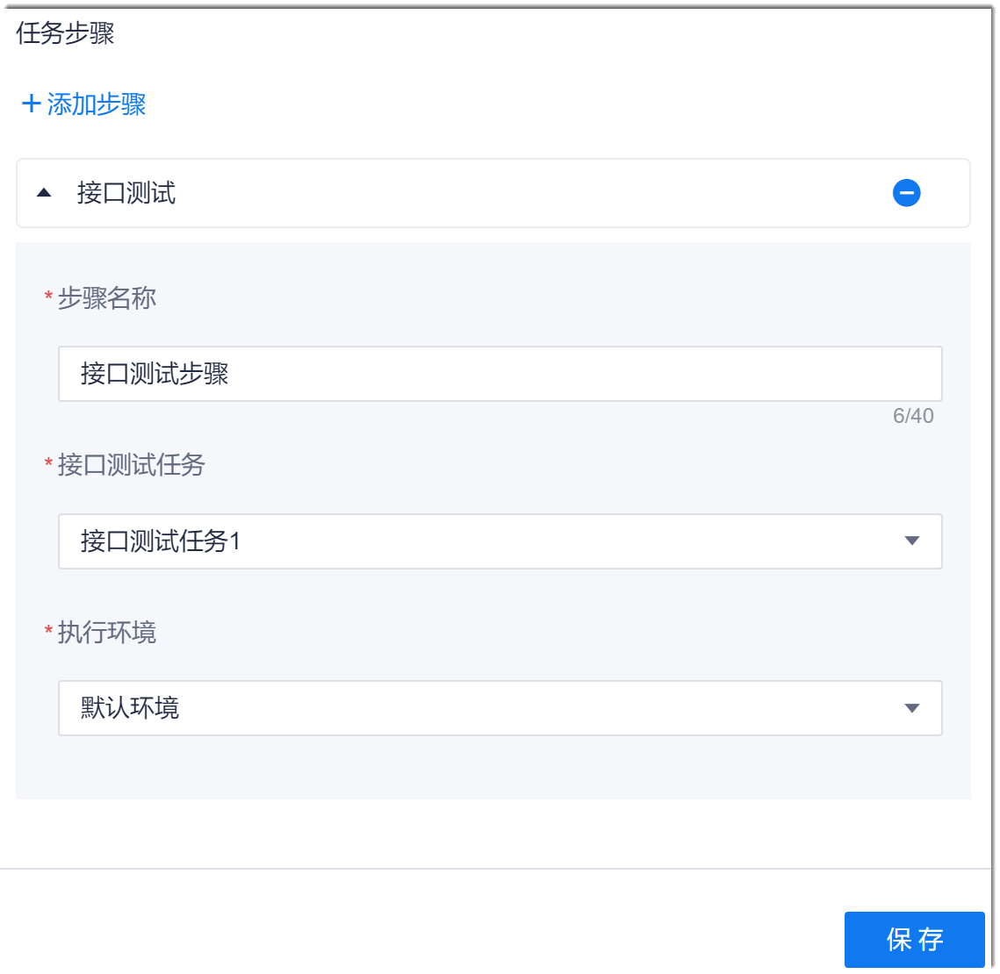

# 接口测试

系统流水线中的接口测试步骤，引用“测试”服务中的接口测试任务。因此，在配置流水线中的接口测试步骤前，需在“测试”服务中创建接口测试任务。

### 操作步骤
1. 在流水线的任务编辑页面中，添加“测试 > 接口测试任务”步骤。
2. 配置接口测试步骤。                             
     配置“步骤名称”、  选择“接口测试任务”和“执行环境”，单击“保存”。                             
     

