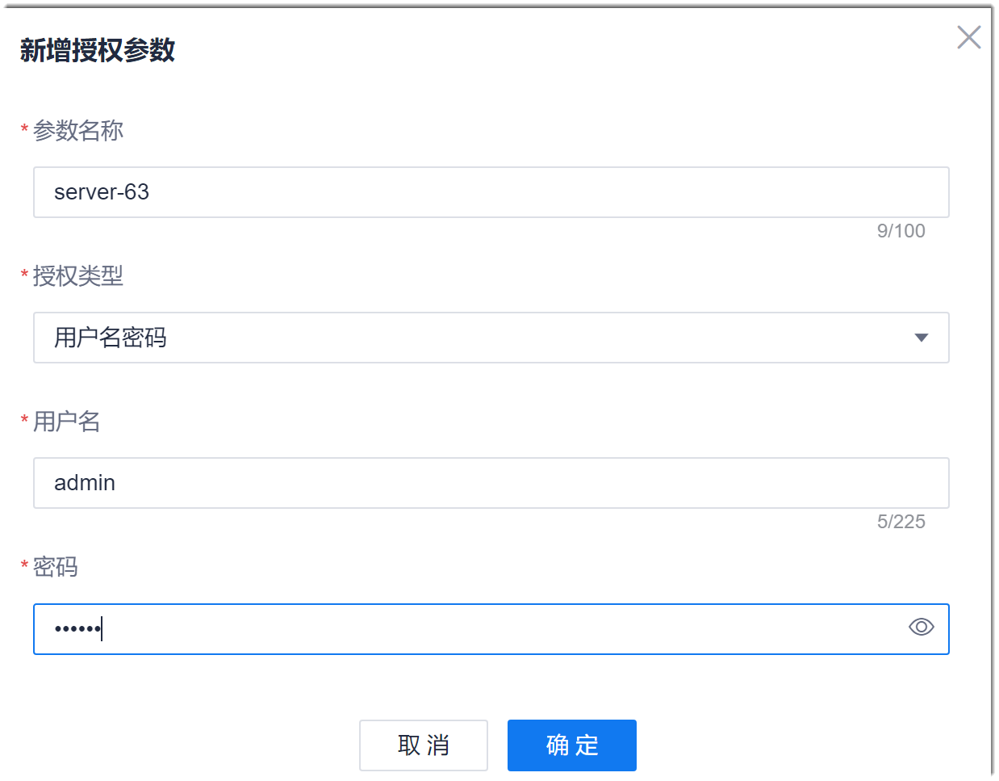
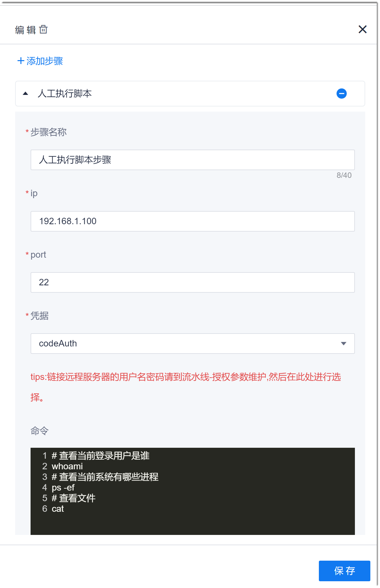

# 配置人工执行脚本步骤

当流水线中需要单独执行脚本时，例如需要将构建好的软件包上传到特定服务器时，您可以添加“人工执行脚本”步骤。

当前支持在服务器上执行Linux命令。

### 操作步骤
1. （可选）建议执行：配置远程服务器的用户名和密码的授权参数。                   
     连接远程服务器需要使用用户名和密码登录。您需要将用户名和密码配置为授权参数，然后在流水线中引用。
   1. 在流水线编辑界面中，单击“授权参数”页签。
   2. 在授权参数列表界面右上方，单击“新建参数”。
   3. 在“新建授权参数”对话框中，自定义“参数名称”，设置“授权类型”为“用户名密码”，然后在用户名和密码参数中输入远程服务器的登录信息，单击“确定”。                   
     
     
2. 在流水线的任务编辑页面中，添加“扩展 > 人工执行脚本”步骤。
3. 配置“人工执行脚本”步骤。              
     输入步骤名称，远程服务器的IP地址和端口号，在“凭据”中选择登录远程服务器的授权参数，在命令框中输入需要执行的脚本，单击“保存”。                            
      

