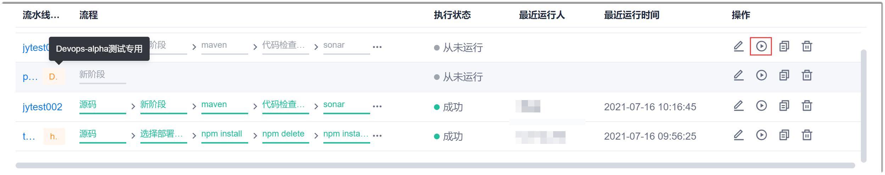
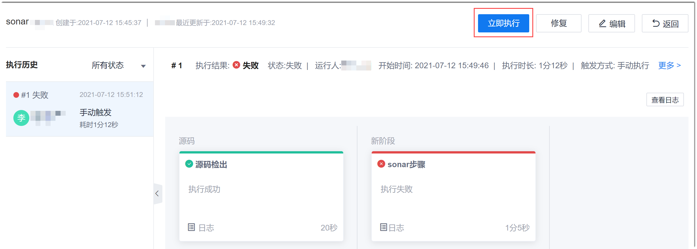
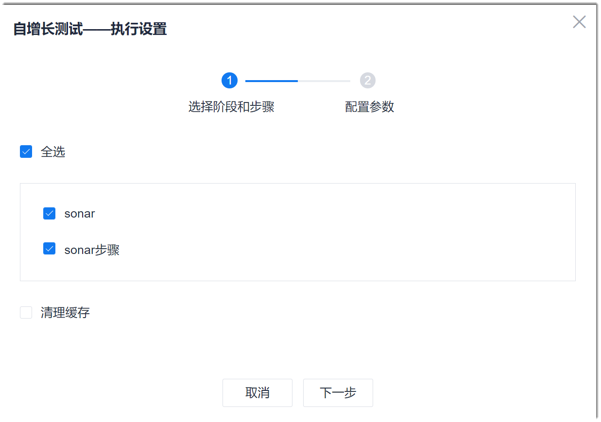

# 执行流水线

流水线可以定时自动执行，也可以手动执行。

### 前提条件
* 手动执行：已使用具有流水线“执行”权限，且已成为流水线成员的账号登录系统。
* 定时执行：已使用具有流水线“触发设置”权限，且已成为流水线成员的账号登录系统。
* 已创建流水线。

### 手动执行
1. 选择如下任一方式手动启动流水线：
  * 在项目流水线列表中，单击操作列的。            
                       
  * 在项目流水线列表中，单击流水线名称。然后在流水线执行结果界面的右上方，单击“立即执行”。            
                        
2. 在弹出的流水线执行设置对话框中，根据界面引导，设置执行的阶段、代码库分支或标签、执行参数的取值。        
  

### 配置定时执行       
如果在流水线中引用了需要运行时设置的参数，则启动执行后，系统将弹出对话框，提示设置对应的参数值。对于定时执行也一样。因此，对于引用了需要运行时设置参数的流水线，建议执行时间设置为有人值守的时间，避免流水线因等待设置参数而无法按时执行。                     
定时执行时，将执行流水线的所有阶段。                       
1. 在流水线列表中，单击操作列的，或者在流水线列表中，单击流水线名称，然后单击右侧的“编辑”，进入流水线编辑界面。
2. 单击“触发设置”页签。
3. 在“执行计划”中，单击“每日定时执行”或“每周定时执行”，然后设置执行时间，单击“保存”。             
     执行时间可以设置多个。                        
     

配置定时执行周期后，系统会根据配置的定时时间自动执行流水线。

