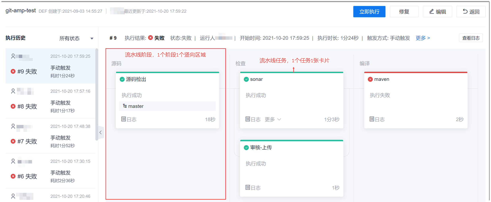
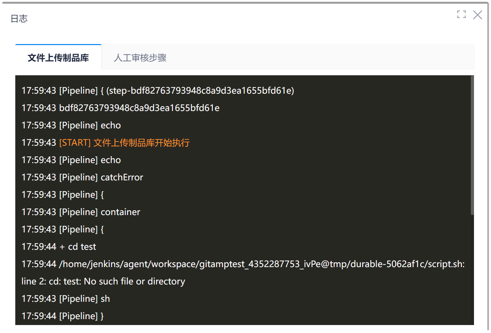
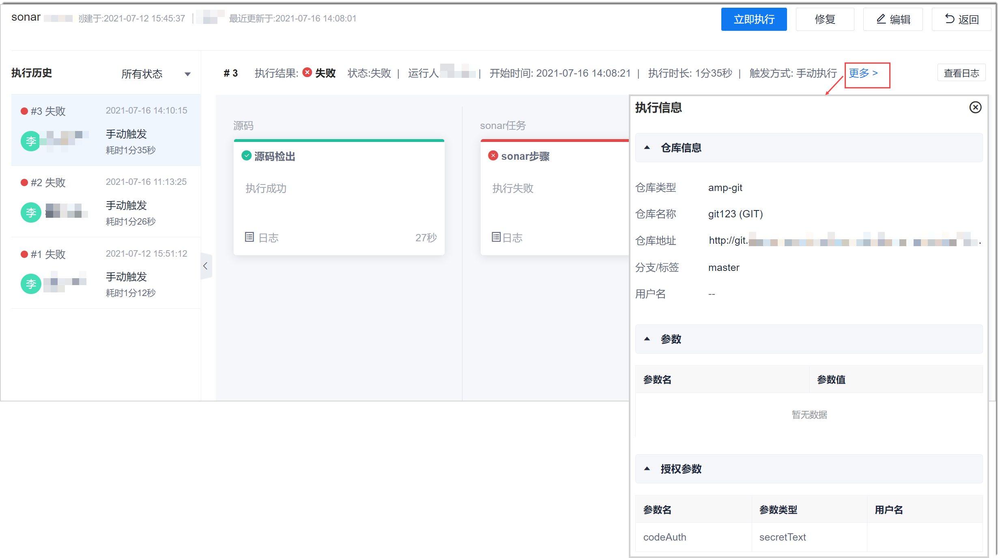
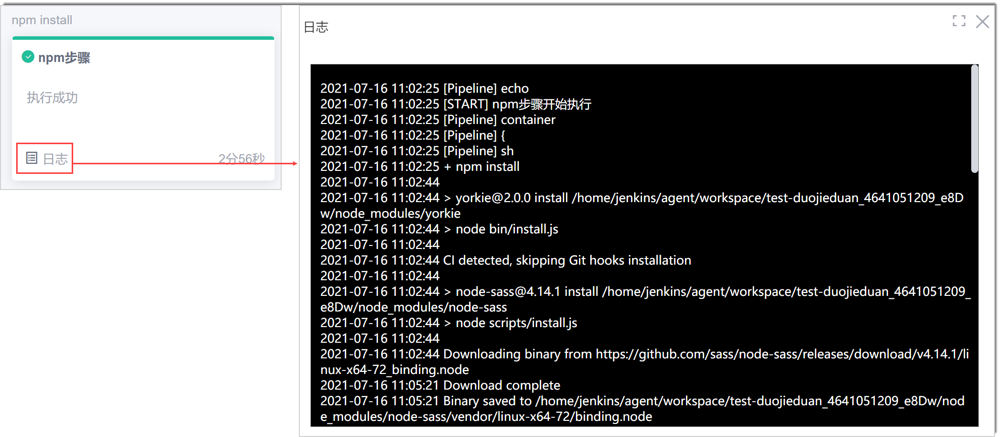
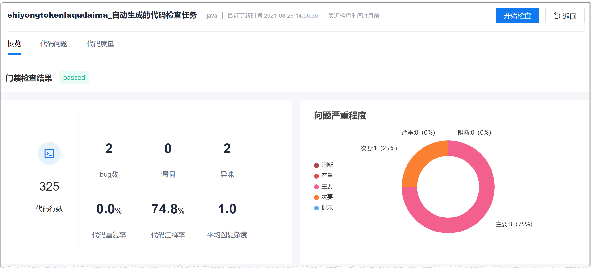
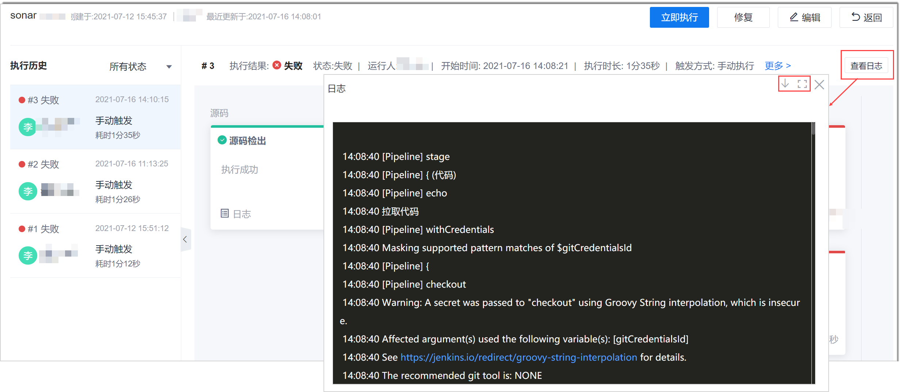
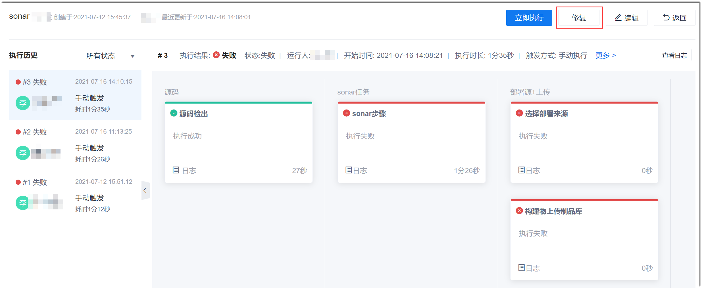

# 查看并处理执行结果

流水线执行完成后，您可以查看执行结果，也可以查看历史执行的执行情况和结果。

### 前提条件
* 已使用具有流水线“查看流水线”权限，且已成为流水线成员的账号登录系统。
* 流水线已有执行记录。

### 查看执行结果      
在项目流水线列表页面，单击流水线名称，进入流水线的执行结果页面。           
页面左侧显示流水线的执行历史，按执行时间由近到远排列。右侧默认显示最近一次执行结果，显示每个阶段、每个任务的执行结果。                  
> [!NOTE]
> 如果流水线中有步骤执行失败，且该步骤未开启“失败后继续运行”，则相应的步骤、任务和流水线的状态均显示失败；如果流水线中有步骤执行失败，且该步骤已开启“失败后继续运行”，则相应的步骤、任务和流水线的状态均显示成功。如果步骤产出与流水线状态不一致，请查看对应步骤的流水线执行日志，检查是否有报错。       

您可以单击历史执行记录，查看流水线的历史执行结果。       
横向排列的任务卡片表示串行任务，竖向排列的任务卡片表示并行任务。      
             
如果一个任务中包含多个步骤，您可以单击任务日志，查看每个步骤的执行情况和日志。         
             

### 查看流水线的执行详情        
执行详情包括执行的代码库信息、参数信息等。       
在执行结果页面的上方，单击“更多”，查看流水线的执行详情。        

### 查看执行日志
在流水线执行详情页面中，您可以：
* 查看单个任务的执行日志或执行结果         
  您可以单击流水线任务卡片左下角的“日志”查看执行日志，或者单击“更多”查看执行结果或其他信息。             
  例如，Npm编译构建任务执行成功，单击左下角的“日志”，显示：               
                  
  例如，代码检查任务执行成功，单击“更多 > sonar-扫描报告”，查看代码检查的结果：            
                             
* 查看整个流水线的执行日志
  您也可以查看整个流水线的执行日志，并下载日志。                       
  在流水线结果结果界面的右上方，单击“查看日志”。如果需要下载日志，单击日志界面的。如果需要全屏显示日志，单击日志界面的                 
  
  
### 修复流水线         
   当您已经处理了步骤的配置问题后，如果流水线还是执行失败，建议可以修复流水线。修复流水线将会清理流水线的运行缓存，重新生成脚本到引擎中。          
     在流水线执行情况页面中，单击右上方的“修复”，然后在弹出的确认框中单击“确定”。         
     

