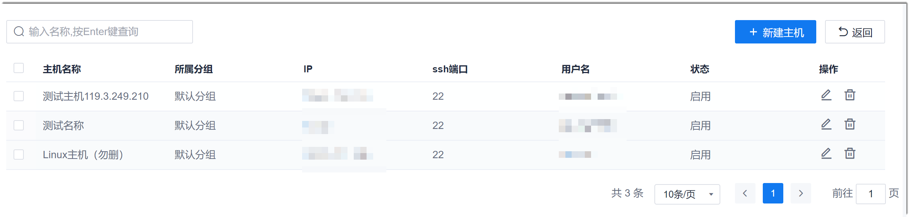

# 管理主机

在执行[主机部署](12.3.3.2-deploy-on-hosts.md)前，需要先将主机信息纳入CAP的流水线中进行管理，然后才能在[主机部署](12.3.3.2-deploy-on-hosts.md)时，选择对应的部署主机。

### 添加主机
1. 在流水线列表界面中，单击右上角的“其他设置 > 管理主机”。       
  进入主机管理界面。             
          
2. 在右上角单击“新建主机”。
3. 在弹出的“新增主机”对话框中，根据下表的描述，填写主机信息，单击“确定”。          
  
  <table>
<tr>
    <th>参数</th>
    <th>说明</th>
</tr>
<tr>
    <td>主机名称 </td>
    <td>自定义主机名称。支持最多32个字符。</td>
</tr>
<tr>
    <td>所属分组 </td>
    <td>从已有分组中选择所属的分组。分组取值来源于[创建流水线](12.2-create-pipeline.md)中设置的分组。</td>
</tr>
<tr>
    <td>IP</td>
    <td>主机的IP地址。</td>
</tr>
<tr>
    <td>SSH端口</td>
    <td>主机的SSH端口号。</td>
</tr>
<tr>
    <td>用户名</td>
    <td>具备主机读写权限的用户名。</td>
</tr>
<tr>
    <td>密码</td>
    <td>“用户名”对应的密码。</td>
</tr>
<tr>
    <td>状态</td>
    <td>启用：该主机可以在流水线的“主机部署”步骤中被发现。
禁用：该主机不能在流水线的“主机部署”步骤中被发现。
</td>
</tr>
</table>

系统返回主机列表，可以查看刚刚添加的主机。

### 修改主机信息
在主机列表中，单击主机后面的。然后在弹出的对话框中修改主机的信息，单击“确定”。

### 删除主机
已经被引用的主机不能被删除。如果需要删除被引用的主机，请先解除流水线对主机的引用。           
在主机列表中，单击主机后面的。然后确认删除。
 

