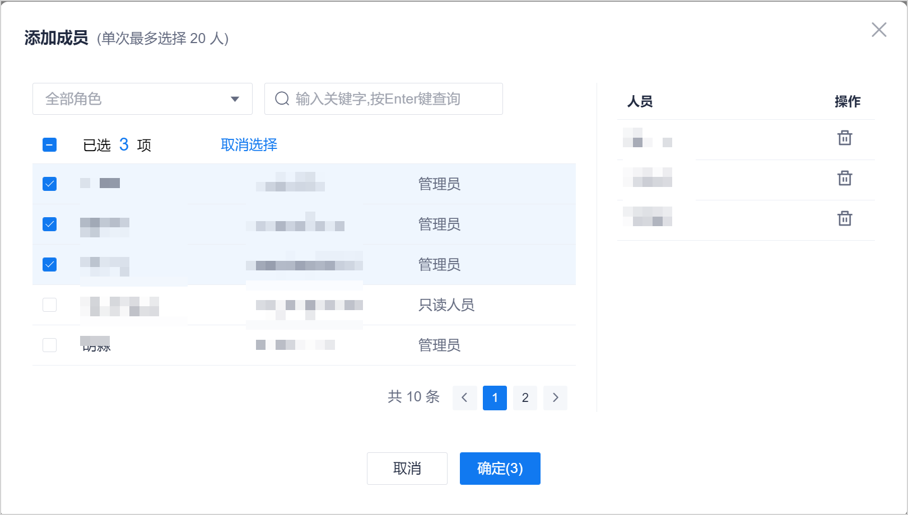

# 管理流水线成员

流水线成员首先应该是项目成员。每个流水线分别管理各自的成员。加入流水线的成员具有流水线的所有权限。

### 前提条件
* 已使用具有流水线“成员管理”权限，且已成为流水线成员的账号登录系统。

### 背景信息
项目的“项目负责人”和流水线创建者默认拥有所有流水线的权限。其它角色的成员需加入流水线后，才拥有流水线的权限。       
流水线的成员可以添加项目的某个角色的所有成员，也可以单独添加某个成员。

### 添加成员               
1. 在项目流水线列表中，单击操作列的，进入流水线编辑界面。
2. 单击“成员管理”页签。                    
     页面显示仓库中的成员列表。                   
3. 在右上方，单击“添加成员”。
4. 在“添加成员”对话框中，在左侧区域中，选中需要添加的账号，单击“确定”。        
   在选择成员时，您也可以通过列表上方的角色进行筛选，或者输入用户名进行搜索。         
     
     
添加成功后，新添加的成员显示在流水线成员列表中。

### 删除成员
在流水线成员列表中，单击成员后面的，删除成员。
