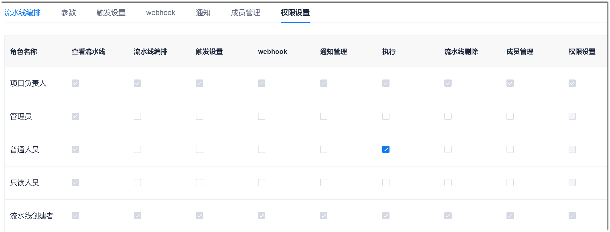

# 管理流水线权限

项目负责人和流水线创建者可以设置流水线成员的权限。流水线的权限由流水线成员所属的项目角色赋予。

### 前提条件
* 已使用项目负责人或者流水线创建者的账号登录系统。

### 操作步骤
1. 在项目流水线列表中，单击操作列的，进入流水线编辑页面。
2. 单击“权限设置”页签。             
     页面显示项目角色和流水线创建者当前具有的流水线权限。其中，置灰的权限框表示该权限不可被修改。          
     流水线默认的权限如下图所示。           
         
3. 根据实际情况，设置各角色的流水线权限。
