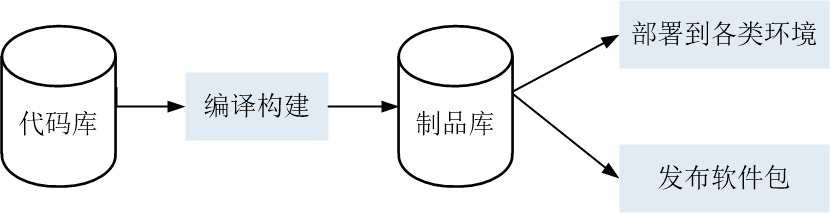

# 制品管理概述

制品库服务用于管理待发布或部署的软件包，以及软件包存放的仓库信息，保障软件发布过程的规范化、可视化及可追溯。      

“软件包”的管理是发布/部署过程管理的基础，也是软件开发过程中的重要资产，常见的软件研发过程如下：          
                
制品库是连接持续集成和持续交付的重要环节，软件包的发布评审、追溯和安全控制等操作通常在其中进行。           

综上，制品库服务主要包含如下功能：             
*   软件发布库：用户管理所有编译构建或打包生成的软件包实体，以及软件包存放的仓库信息。
*   私有依赖库：相对于“maven central”等开源中央仓，私有依赖库提供企业内部管理私有公共组件的私服，适配各种语言及依赖包管理工具，如Maven、Npm等。

系统中的Docker镜像仓库和文件仓库为软件发布库，Maven仓库只作为Maven构建和Gradle构建的依赖仓库。