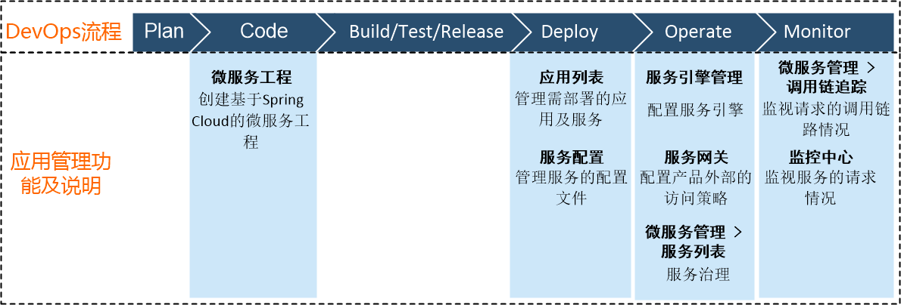

# 应用管理概述

系统的应用管理覆盖DevOps流程编码、部署、运维、监控阶段。应用管理对于以上几个阶段的支撑如下图所示。应用管理在运维阶段主要实现服务治理功能。            

### 服务治理         
要实现服务治理，首先需要发现服务。系统通过添加服务引擎，使服务可以在注册中心或命名空间内部被发现和访问；通过添加服务网关，使服务可以在外部被发现和访问。        
系统当前支持Spring Cloud、Nacos、Istio服务引擎类型：
* **Spring Cloud**       
  Spring Cloud是一个基于Spring Boot的微服务开发和治理框架，实现快速构建分布式系统中的常见模式，包括：配置管理、服务注册与发现、智能路由、负载均衡、消息总线、断路器、数据监控等。       
  在本系统中，Spring Cloud采用Eureka作为服务发现框架。
  
* **Nacos**     
  Nacos是构建以“服务”为中心的服务基础设施，致力于微服务的发现、管理和信息配置，能帮助用户快速实现动态服务发现、服务配置、服务元数据及流量管理，从而更敏捷、更容易的构建、 交付和管理微服务平台。         
  Nacos支持几乎所有主流类型(诸如: Kubernetes Service. gRPC & Dubbo RPC Service.SpringCloud RESTful Service)的服务发现、配置和管理。

* **Istio**      
  Istio是基于Serice Mesh的一种服务管理平台，适用于微服务架构。服务之间的通信通过代理来进行。Istio提供服务的连接（例如服务发现、负载均衡、流量控制等）、安全加固、控制（例如访问规则控制）和观察（例如流量）等服务。从而为微服务架构下的故障排查、应用容错性、应用升级发布、系统安全等难题提供了可能的解决方案。     

服务被发现后，您可以对服务进行治理，包括路由配置、熔断、限流等操作；也可以监视服务的运行情况，包括调用链追踪、服务监视等。

