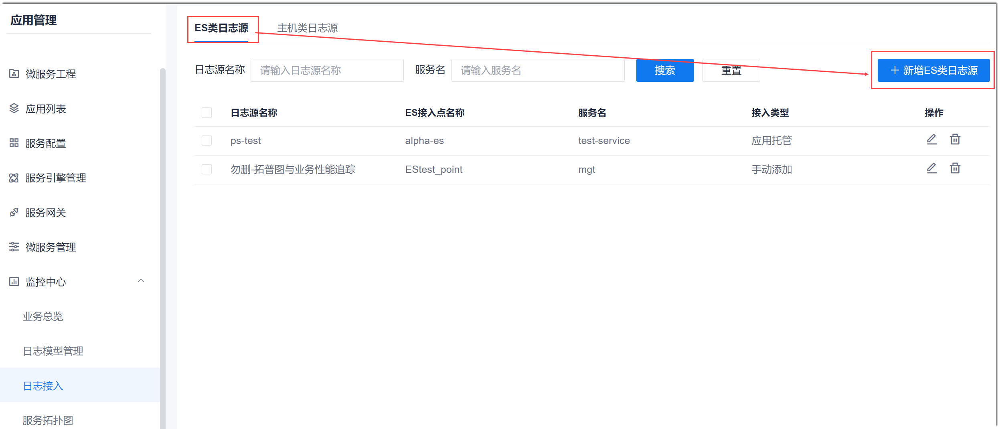
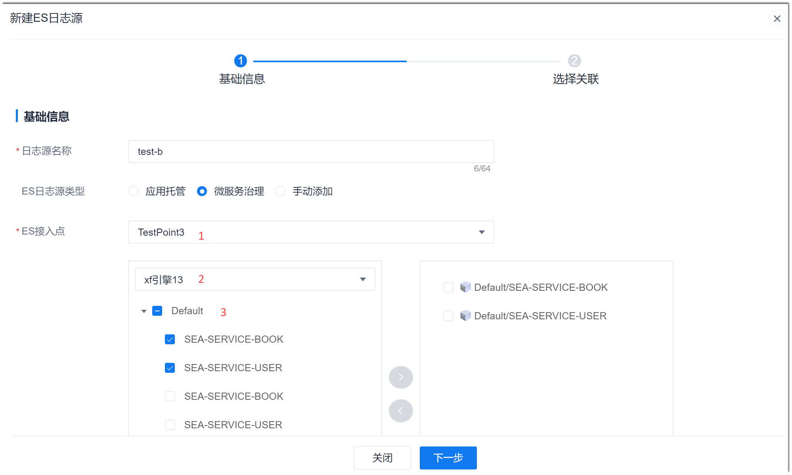
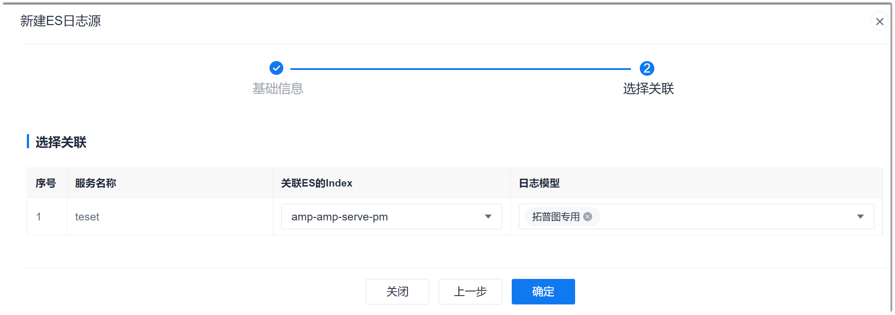

# 管理ES类日志源

ES类日志源适用于接入了ES引擎的服务。ES类日志源需设置ES接入点、服务、ES的索引和日志模型。

### 前提条件
* 已配置ES接入点，详细请参见[管理ES接入点](6.7.4-manage-ES-ap.md)。
* 已配置日志模型，详细请参见[管理日志模型](15.3.3.0-config-log-model.md)。

### 背景信息                       
ES接入点用于配置ES引擎的URL地址、认证信息以及日志索引的信息，使系统能访问ES引擎，获取对应的日志。为了统一管理项目相关的资源，因此在项目设置中对ES接入点进行统一管理。             
ES日志源分为三类：
* **应用托管**：服务来源于“应用管理 > 应用列表”中配置的服务。
* **微服务治理**：服务来源于“应用管理 > 服务引擎管理”中配置的引擎中包含的服务。
* **手动添加**：其它对接了ES引擎的服务。

### 新建ES类日志源
1. 在项目顶部菜单栏中，单击“应用管理 > 监控中心 > 日志接入”。
2. 在右侧页面中，单击“ES类日志源”页签，然后单击“新增ES类日志源”。      
      
3. 在“新建ES日志源”的基础信息页面中，根据下表的描述，填写参数，单击“下一步”。          
               
  <table>
<tr>
    <th>参数名称</th>
    <th>说明</th>
</tr>
<tr>
    <td>日志源名称</td>
    <td>自定义日志源的名称。最多支持64个由中文、英文、“-”、“_”组成的字符串。</td>
</tr>
<tr>
    <td>ES日志源类型</td>
    <td><ul><li>应用托管：服务来源于“应用管理 > 应用列表”中配置的服务</li><li>微服务治理：服务来源于“应用管理 > 服务引擎管理”中引擎包含的服务</li><li>手动添加：其它接入了ES引擎的服务</li></ul></td>
</tr>
<tr>
    <td>ES接入点</td>
    <td>包含3个部分：<ul><li>1：ES接入点。下拉菜单的取值来源于“项目设置 > 接入点设置 > ES接入点”中的配置。</li><li>2：根据日志源类型不同，选择的内容不同：<ul><li>应用托管：选择K8s集群。下拉菜单的取值来源于“项目设置 > 接入点设置 > Kubernetes接入点”中已启用的配置。</li><li>微服务治理：选择服务引擎。下拉菜单的取值来源于“应用管理 > 服务引擎管理”中配置的引擎。</li><li>手动添加：自定义服务名称。</li></ul></li><li>3：对于“应用管理”和“微服务治理”，选择需要监控的服务，然后单击  。日志源类型为“应用托管”时，取值来源于“应用列表”中已在该K8s集群下配置的服务；日志源类型为“微服务治理”时，取值来源于引擎下包含的服务。
对于“手动添加”，选择服务对应的图标，并单击“添加服务”。
</li></ul></td>
</tr>  
</table>
4. 在“新建ES日志源”的选择关联页面中，依次选择每个服务的“关联ES的Index”，以及“日志模型”，单击“确定”。             
  其中：
  * “关联ES的Index”的取值来源于系统获取到的ES接入点的索引信息。
  * “日志模型”的取值来源于配置的“日志模型”。
               

系统返回ES类日志源列表页面，显示刚刚添加的ES日志源。

### 修改ES类日志源
1. 在ES类日志源列表中，单击日志源后面的。
2. 在“编辑ES日志源”页面中，修改相应的信息，单击“确定”。

### 删除ES类日志源
1. 在ES类日志源列表中，单击日志源后面的。
2. 在弹出的确认对话框中，单击“确定”。
