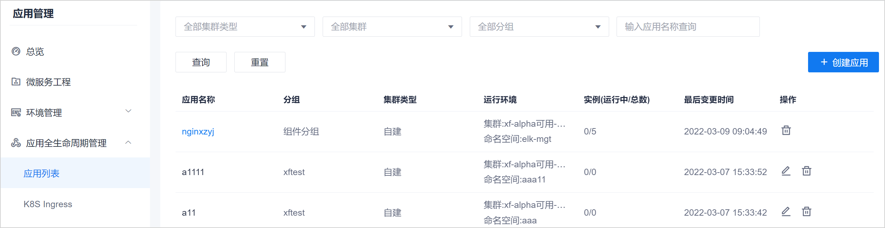

# 创建应用

应用可以通过界面和yaml文件两种方式创建。系统当前只支持yaml文件的方式。界面配置的方式将在后续版本支持。                             

### 前提条件                         
 * 已使用具有项目“应用全生命周期管理 > 创建应用”权限的账号登录系统。

### 操作步骤
1. 在项目顶部菜单栏中，单击“应用管理”。
2. 在左侧导航栏中，单击“应用全生命周期管理 > 应用列表”。                     
  右侧页面显示已创建的应用列表。                
                    
3. 在页面右上方，单击“创建应用”。                        
4. 下载并编写yaml模板。            
  在“创建应用”页面中，单击右上角的“下载yaml模板”。然后打开yaml模板，基于模板编写yaml文件。                         
  yaml文件中包含镜像拉取策略、部署策略等信息，并对内容有注释信息：                 
                                
5.  在“创建应用”页面中，填写应用的相关信息，然后选择操作方式：         
  * **保存**：只保存配置，不部署应用。保存后，系统返回应用列表页面。
  * **部署**：保存配置，并部署应用。部署后，系统进入应用详情页面，默认显示应用的基本信息。
                             
  <table>
<tr>
   <th>参数名称</th>
    <th>说明</th>
</tr>
<tr>
    <td>操作方式</td>
    <td>当前版本只支持yaml文件的方式。</td>
</tr>
<tr>
    <td>应用名称</td>
    <td>自定义应用的名称。最多支持64个字符。字符可为：数字、小写字母、.、-，且以数字、小写字母开头结尾。</td>
</tr>
<tr>
    <td>分组</td>
    <td>可手动输入分组名称，或者从已有的分组名称中选择。手动输入时，仅支持这些字符类型：中文、字母、数字、.、_、-。输入完成后，按**Enter**键确认。</td>
</tr>
<tr>
    <td>集群</td>
    <td>下拉列表的取值来源于“环境管理 > K8s集群”中的集群列表。
您也可以单击后面的“新增”，新增一个集群。
</td>
</tr>
<tr>
    <td>命名空间</td>
    <td>下拉列表的取值来源于已选择“集群”中包含的命名空间。</td>
</tr>
<tr>
    <td>yaml文件</td>
    <td>在第4步中下载模板并填写yaml文件后，将yaml文件上传到系统中。上传后，下方的脚本区域会显示yaml文件的内容。
您也可以直接在脚本区域中编写yaml文件，或者将yaml文件中的内容拷贝到脚本区域中。

您可以在脚本区域编辑yaml文件的内容。
</td>
</tr>
</table>

