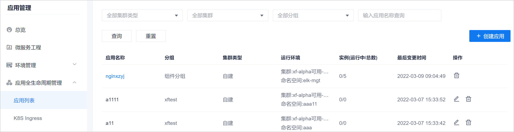
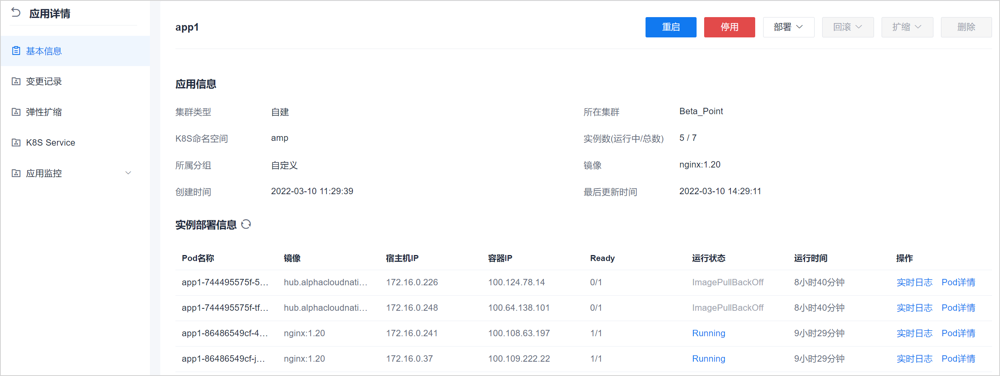

# 查看应用详情

应用创建或部署完成后，可以查看应用的详细信息。

### 前提条件         
* 已使用具有项目“应用全生命周期管理 > 查看应用详情”权限的账号登录系统。     

### 操作步骤   
1. 在项目顶部菜单栏中，单击“应用管理”。 
2. 在左侧导航栏中，单击“应用全生命周期管理 > 应用列表”。                    
  右侧页面显示已创建的应用列表。                
  其中：
  * 已保存但未部署的应用，操作列有编辑按钮。已部署的应用不可被修改，所以操作列无编辑按钮。
  * 对于已部署的应用，应用名称显示为蓝色。可单击应用名称，查看更详细的应用信息，并对应用执行部署、升级等操作。
                    
  
3. （可选：对于已部署的应用）单击应用名称，进一步查看应用的详细信息。            
  页面默认显示应用的基本信息。您可以查看应用中部署的实例信息，包括实例的状态、实时运行日志，以及Pod详情等。             
             
4. 单击pod对应的“实例日志”或“Pod详情”，查看实例的运行日志，以及Pod的详细信息。         
  其中，Pod详情当前只显示Pod事件。                 
  

