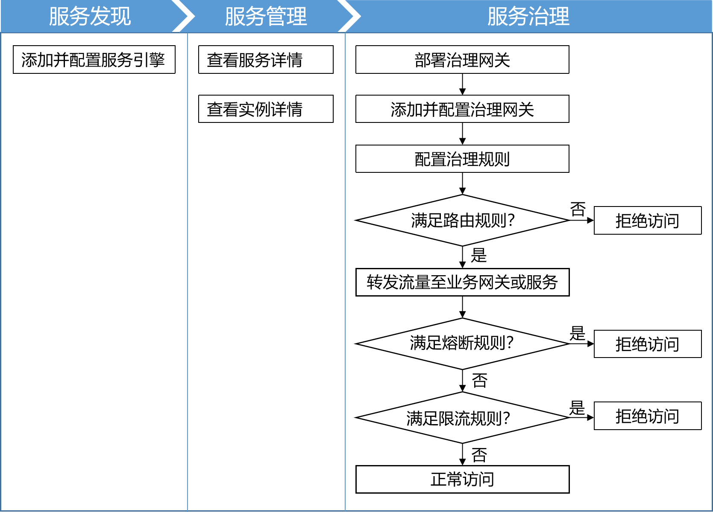
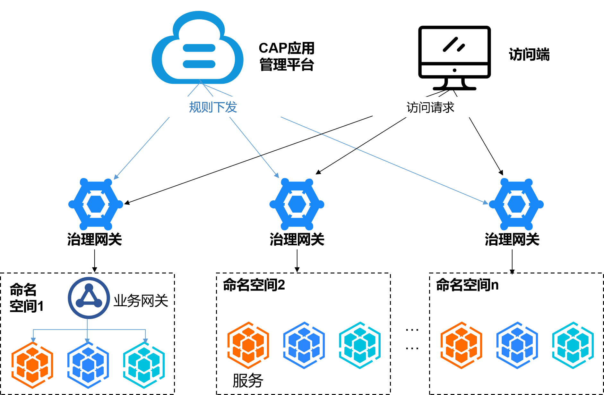

# 发现和治理服务

微服务治理首先需要发现服务。通过配置服务引擎的注册中心、配置中心、Kubernetes集群、命名空间、认证信息等，可以发现服务并获取服务列表。
服务被发现以后，您可以查看服务中的实例详情，并根据需要进行服务治理，包括设置路由规则、限流规则和熔断规则。             

在进行服务治理前，需要部署并配置治理网关，用于治理规则的下发和请求流量的转发。治理网关与服务引擎中的命名空间一对一绑定，便于数据隔离，保障数据安全。            

微服务治理的业务流程如下图所示。                
           

微服务治理的逻辑结构图如下图所示。                
            
其中：
* **CAP应用管理平台**控制多个环境、多个节点的治理网关。在应用管理平台配置的治理策略下发到治理网关，再由治理网关进行规则判断，执行相应操作。
* **治理网关**收到访问请求后，基于治理策略进行判断，将允许访问的请求下发到业务网关或直接下发到服务。

CAP当前的微服务治理支持基于K8s集群的微服务架构，Eureka、Nacos、Istio服务引擎框架。因此，在进行微服务治理前，请确保服务是基于K8s集群的微服务部署架构，并且对应的服务引擎已部署到服务的K8s集群中。                 
CAP后续将支持非微服务架构的治理服务，敬请期待。

