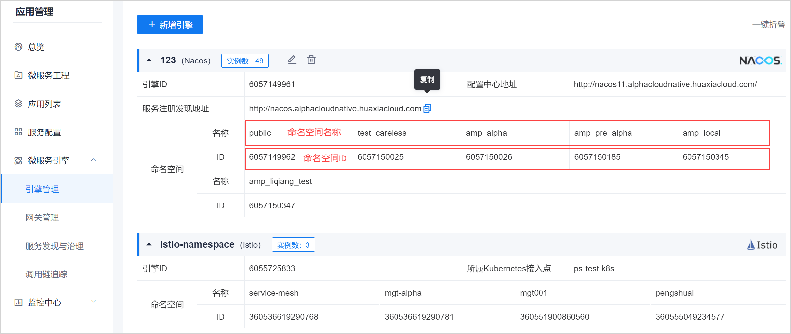

# 发现服务

通过在CAP应用管理平台上配置服务引擎以及引擎相关信息，发现引擎中的服务及实例：
* 对于Eureka引擎：需配置注册中心和配置中心地址，并选择性配置认证信息。
* 对于Nacos引擎：需配置注册中心和配置中心地址，并选择性配置认证信息，然后获取引擎下的命名空间。
* 对于Istio引擎：需配置Kubernetes接入点，然后获取引擎下的命名空间。

服务引擎配置成功并连通后，引擎管理页面显示所有已添加的服务引擎的信息，如下图所示：       
                   

您可以在引擎管理页面中，查看引擎的配置信息，以及引擎中包含的命名空间名称及ID。