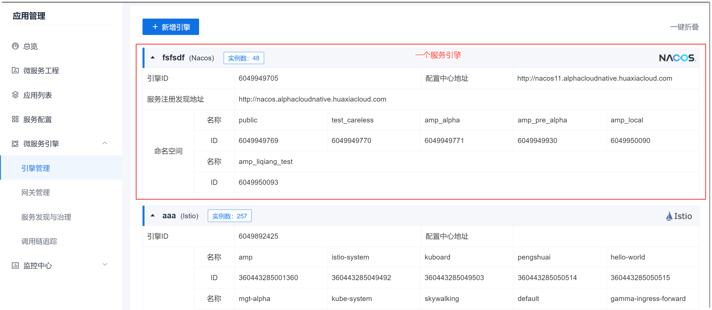
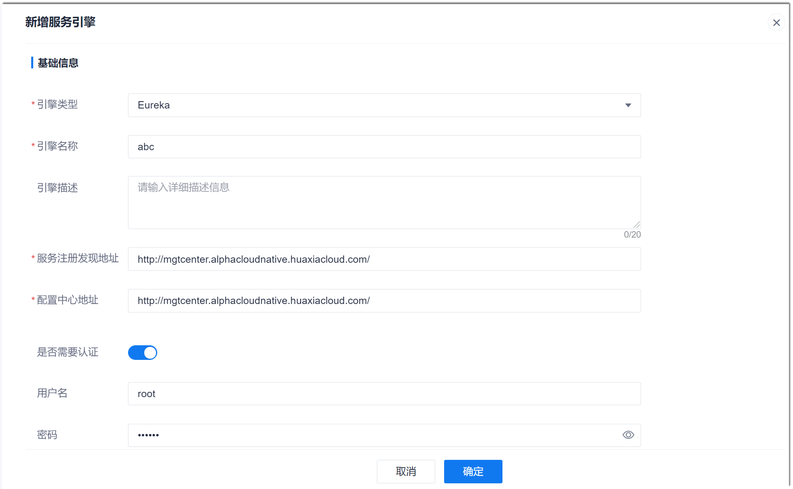

# 添加服务引擎

添加服务引擎通过选择服务开发时使用的框架和发现服务的地址，用于发现和治理服务。

### 前提条件    
* 已使用具有项目“服务引擎管理&服务网关 > 添加引擎”权限的账号登录系统。
* 服务引擎已部署到服务所属的K8s集群中。
* 已获取服务引擎的相关信息：
  * Istio：服务所属的K8s和命名空间已在系统上添加，且已获取K8s集群名称和命名空间名称。        
    K8s集群已添加到Kubernetes接入点中，请参见[添加K8s接入点](6.7.1.2-new-k8s-ap.md)。
  * Eureka、Nacos：已获取服务注册发现地址和配置中心地址。如果需要认证，还需获取认证用户名和密码。

### 操作步骤
1. 在项目顶部菜单栏中，单击“应用管理”。
2. 在左侧导航栏中，单击“微服务引擎 > 引擎管理”。           
  右侧显示服务引擎列表。    
           
3. 在右侧页面中，单击左上角的“新增引擎”。
4. 在弹出的“新增服务引擎”对话框中，根据下表的描述设置参数，单击“确定”。                    
         
  
  <table>
<tr>
    <th>引擎类型</th>
    <th>参数名称</th>
    <th>说明</th>
</tr>
<tr>
    <td rowspan="3">Eureka、Nacos、Istio</td>
    <td>引擎类型</td>
    <td>根据实际情况选择微服务使用的引擎类型。</td>
</tr>
<tr>
    <td>引擎名称</td>
    <td>自定义引擎名称，不超过15个字符。</td>
</tr>
<tr>
    <td>引擎描述</td>
    <td>自定义对引擎的描述信息，不超过20个字符。</td>
</tr>
<tr>
    <td rowspan="5">Eureka、Nacos</td>
    <td>服务注册发现地址</td>
    <td>根据实际情况填写服务注册中心地址。</td>
</tr>
<tr>
    <td>配置中心地址</td>
    <td>根据实际情况填写服务配置中心地址。</td>
</tr>
<tr>
       <td>是否需要认证</td>
    <td>根据实际情况选择访问微服务的配置中心是否需要认证。如果需要认证，则需要填写认证的用户名和密码。</td>
</tr>
<tr>
    <td>用户名</td>
    <td>需要认证时配置。根据实际情况填写认证的用户名。</td>
</tr>
<tr>
    <td>密码</td>
    <td>需要认证时配置。根据实际情况填写认证的密码。</td>
</tr>
<tr>
    <td>Nacos</td>
    <td>命名空间</td>
    <td>命名空间不可配置，从服务引擎中直接获取。单击参数后面的“获取命名空间”获取。</td>
</tr>
<tr>
    <td rowspan="2">Istio</td>
    <td>kubernetes接入点</td>
    <td>选择部署Nacos的kubernetes集群信息。取值来源于<a href="6.7.1.2-new-k8s-ap.md">K8s接入点</a>中的配置。
一个kubernetes接入点只能关联一个引擎。如果选择已关联引擎的kubernetes接入点，则系统会提示“该服务引擎已添加”。
</td>
</tr>
<tr>
    <td>命名空间</td>
    <td>命名空间不可配置，从服务引擎中直接获取。单击参数后面的“获取命名空间”获取。</td>
</tr>
</table>

系统返回引擎管理页面。您可以看到新增的引擎。

